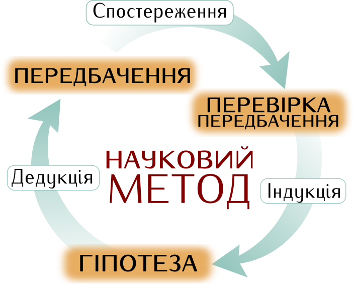
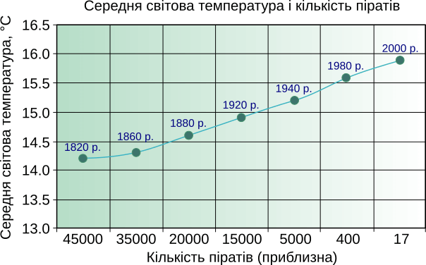

# Вступ, {.ws}
де читач знайомиться із поняттям даних, практиками їхнього застосування
і місцем цих практик в журналістиці та громадській діяльності.

Ми дуже часто чуємо і робимо твердження на кшталт
«20% людей випивають 80% пива» чи
«90% користувачів MS Word використовують менше відсотка його можливостей».
Ці вислови *стилізовано під результати роботи з даними.*
Числа переконують, але як часто вони адекватно відображають реальність?
Ми про це навряд чи дізнаємося, якщо *вони не посилаються на реальні спостереження*
споживання пива чи використання редактора документів.

Дуже часто за такими висловами стоїть упередження, стереотип, поведінковий шаблон.
Поки цифри взято зі свого бачення реальності (яке в кожної людини унікальне)
за допомогою «здорового глузду», а то і просто *зі стелі*,
ці твердження є в кращому разі *риторичною фігурою*,
якщо не відвертою неправдою.
В них легко повірити, але перевірити — ні.
І навряд чи від рішень, прийнятих на їхніх підставах, варто чекати ефективності.

Наша вимогливість до достовірності та якості інформації,
як правило, прямо пропорційна важливості чи ціні рішення.
(Звісно, бувають винятки.
Деякі дуже важливі рішення приймаються ***всупереч*** даним —
скажімо, «за покликом серця»).
Тому робота з даними є характерною галуззю господарчої діяльності протягом всієї історії цивілізації.
Наприклад, найдавніша відома писемність — шумерська — виникла,
як свідчать пам’ятки, головно з метою обліку майна
(ті тексти, що ми їх знаємо як тодішню літературу, збереглися як матеріал вправ для писців).
Це, безумовно, було прикладом збирання і структурування даних.

> #### щодо наукового методу {.secret-knowledge}
> 
>
>Ідея пізнання світу в спосіб вимірювань і аналізу — елемент *наукового
підходу*. Відповідно до нього, ми спершу **спостерігаємо** явище, потім
формулюємо **гіпотезу** — модель, що описує поведінку явища, потім
проводимо **експеримент**, результати якого *можуть її спростувати*.
Гіпотеза, для якої неможливо вигадати експерименту, результати якого
могли би спростувати її, не є науковою. Підтверджена експериментами
гіпотеза стає **теорією**.

> #### щодо неспростовних гіпотез {.rake}
В громадському житті ми досить часто зустрічаємося з неспростовними
гіпотезами, наприклад «всі чоловіки — сволота», «дії урядів
контрольовані всесвітньою змовою» або «Бог має щодо тебе особливий
план». Збирання і аналіз даних з приводу таких гіпотез може мати сенс
лише як дослідження їх носіїв.

Дані — як вони виникають в процесі людської активності —
є наслідком виділення у довкіллі об’єктів та явищ,
певні властивості яких можна міряти.
Кожному числу — результату виміру —
відповідають одиниця виміру,
назва вимірюваної властивості
та назва об’єкту, якому належить ця властивість.
Шумерський бухгалтер — назвімо його так —
окремо записував кількість голів худоби, мір зерна та площ полів під посівами.
Сучасний дослідник статків народних обранців
так само записує кількість автомобілів, кількість і площу садиб, тощо.

Така структура включає *модель* того об’єкту чи явища,
дані якого збираються та використовуються.
Використання неправильної моделі
призводить до незастосовних результатів
не меншою мірою ніж помилки у вимірах.

Але не будь-які зібрані дані —
навіть достовірні й правильно структуровані —
є корисною інформацією.
Петер Друкер (Peter Drucker),
якого часто називають найвпливовішим теоретиком в сфері менеджменту,
формулював так:
«Якщо хтось каже „відстежуймо X“,
негайно питайте, як ці дані впливатимуть на наявні рішення
або які рішення вони збираються приймати виходячи з цієї інформації.
Дані, зібрані без мети це різновид сміття.»[^Druker1]

[^Druker1]: If someone says, “Let’s track X!”, immediately ask how that data
    affects existing decisions or what decision they intend to make
    based on the information. Data collected for no reason is a type of
    waste.

Отож, дані мають походити з вимірів реальності,
бути зібраними з певною метою,
організованими з певною метою
і впливати на наявні чи майбутні рішення.

> #### Використання даних реєстру виборців для оцінки руху населення {.example}
> *Часом дані, зібрані з однією метою, можуть виявитися корисними для іншої мети.*
> Так, для оцінки кількості дорослого населення
> по територіальних громадах київської області
> в [дослідженні](http://socialdata.org.ua/ocinka-kilkosti-doroslogo-naselenn/),
> проведеному УЦСД напередодні парламентських виборів 2014 року,
> було неможливо напряму використати дані перепису населення.
> Хоча за стандартами ООН переписи треба проводити кожні десять років,
> останній загальний перепис населення в Україні
> було проведено [2001 року](http://2001.ukrcensus.gov.ua/),
> а наступний (відкладений спершу на 2016, а потім на 2020) не відбувся досі.
> Таким чином, детальні дані про стан та динаміку населення
> на момент дослідження суттєво застаріли.
> Але дані Державного реєстру виборців за цей час оновлювалися неодноразово,
> що дає змогу оцінити густину населення та динаміку за потрібний період,
> враховуючи поправку на те, що виборцями є люди старші за 18 років.
>
> 

Забезпечення реальних —
отриманих шляхом фіксації і аналізу фактів —
даних має свою ціну й історично ця ціна була чималою.
Збирання і аналіз даних за межами найпростішого обліку поточної діяльності
було прерогативою панівних верств суспільства.

Поява масових — друкованих, а згодом і електронних медіа,
зробила доступ до даних демократичнішим,
але до першого десятиліття 21 століття
терміну «журналістика даних» не було,
хоча приклади цього жанру можна зустріти значно раніше.
Це можна пояснити можливістю застосування окремими особами
(завдяки персональним комп’ютерам та інформаційним мережам)
таких засобів роботи з даними,
які ще у 70-х роках 20 століття були доступні лише державам і великим корпораціям —
баз даних, інструментів аналізу і візуалізації.

Чималу роль відіграла також тенденція до відкриття даних,
викликана не в останню чергу
введенням наукових методів організації державного управління і бізнесу.
Традиційне для науки дбайливе ставлення до процедури публікації результатів —
кожен експеримент має бути відтворюваним незалежними дослідниками —
почало проникати до корпоративної і урядової культур.
Не всюди це відбулося рівною мірою,
але в світовому масштабі
тенденція до відкриття даних і стандартизації їхнього обігу очевидна.

Доступність засобів роботи з даними
та відкритість значних масивів даних
впливають на природу людини,
її способи усвідомлення подій і явищ.
Людина інформаційної доби потребує даних незіставно більше, ніж людина минулого.
Якщо прикласти до відкритих даних відомий афоризм Маршалла МакЛюена (Marshall McLuhan)
«medium is the message»[^mcluhan1],
то повідомлення відкритих даних це
**право кожного на прийняття осмислених і зважених рішень
у всіх галузях свого життя.**

[^mcluhan1]: Це можна перекласти як
«середовище, спосіб передачі чи поширення повідомлення — теж є повідомленням»,
але МакЛюен розуміє поняття «media» [ще ширше](http://web.mit.edu/allanmc/www/mcluhan.mediummessage.pdf)
(англ.) — як «подовження людини», своєрідні «додаткові органи».

В той же час
людина — навіть озброєна знаннями і технологіями —
сприймає інформацію (і цифри теж),
в першу чергу емоційно,
тому точніше казати не про «зростання потоків інформації»,
а про зростання **рівня інформаційного і емоційного шуму**.

Кожна людина протягом життя навчається виділяти корисну — тобто придатну
для вивчення ситуації і прийняття рішень — інформацію від шуму,
зрозуміло, що в тих сферах, де вона діяльна і компетентна.
А в інших — не так особисто досліджених і пережитих, але від того не менш важливих —
сферах життя вона лишається відкритою для маніпуляцій.

> #### Використання випадкової кореляції з маніпулятивною метою {.example}
> 
>
> Теза про зменшення кількості піратів,
> як причину глобального потепління — очевидно абсурдна,
> але задіяні дані начебто її підтверджують.
> Побудовані на такому принципі маніпуляції
> довкола менш абсурдних ідей можна зустріти щодня.

Журналіст даних або дата-активіст мають вибір —
долучатися до маніпуляторів даними
чи давати кінцевому споживачеві своєї інформації
якщо не навичку орієнтування в досліджуваному явищі,
то доступ до тих даних і методик,
які було використано в дослідженні.
Незалежно від того,
на користь якої з можливостей зроблено вибір,
місію журналістики даних і дата-активізму можна сформулювати як
*дати сприймачеві пережити певні явища емоційно
за допомогою доступно поданих результатів аналізу даних про ці явища*,
що в свою чергу впливатиме на прийняття ним рішень.

