# 3. Отримання, очищення, структурування даних {.ws #ch3}
*У розділі читач дізнається про основні етапи роботи з даними,
засоби і техніки перетворення немашиночитаних даних в машиночитані,
витягання погано структурованих даних з інтернету,
а також як ці дані очищують і готують до аналізу*


## Отримання даних
Дуже добре, коли дані можливо отримати в машиночитаному форматі:

* як табличні дані CSV, або інший формат з роздільниками;
* як файли електронних таблиць Excel (.xls, .xslsx), OpenDocument (.ods), тощо
(див. [Таблицю машиночитаних форматів даних](#AppTable1) в Додатках).

Це ще не гарантує, що дані можна використати такими, як вони прийшли,
але принаймні дозволяє одразу перейти до їх **очищення**.

Але досить часто отримані дані можуть виявитися не в машиночитаному вигляді.
Це можуть бути, зокрема:

* начитка даних на диктофон;
* паперові машинописи і навіть рукописи;
* файли зображень зі сканами документів
(.png, .gif, .jpg, .jpeg, .jpe, .jfif, .bmp, .tiff тощо);
* багатосторінкові скановані документи —
PDF і DjVu без експортовного тексту (лише зображення сторінок)
та екзотика типу багатосторінкових
TIFF^[наприклад, деякі документи на data.gov.ua доступні саме як багатосторінкові TIFF];
* мультимедійні презентації у відеоформатах;
* документи PDF і DjVu з експортовним текстом;
* презентації PowerPoint (.ppt і .pptx) та OpenDocumentFormat (.odp),
* документи офісних текстових редактоів, найчастіше Microsoft Word (.doc і .docx),
рідше RTF та OpenDocumentFormat (.odt);
* текстові файли (.txt);
* веб-сторінки, що містять дані в тій чи іншій формі.

Неважко помітити, що наведений вище список складено 
від «неприємніших» до «приємніших» випадків,
або, точніше, за неминучістю і безальтернативністю ручного введення.
Пройдімося ним ще раз докладніше.

### Робота з начиткою даних

Мабуть, найжорсткіший випадок.
Звичайно, існують програми перетворення мовлення на текст,
зокрема й такі, що підтримують українську мову, наприклад
*FSM Soft*
[**Speech to Text Translator TTS**](https://play.google.com/store/apps/details?id=com.fsm.speech2text)
(для Android) 
чи *CyberMova* 
[**VoiceTypist**](http://cybermova.com/products/stt-demo.htm)
(для Windows),
але, позаяк їх створено як альтернативу введенню з клавіатури,
для їхнього надійного функціювання начитка має бути нешвидкою, з чіткими паузами між реченнями, тощо.
За допомогою розпізнавалки голосу ми отримуємо **неструктурований текстовий файл**,
роботу з даними в якому розглянуто нижче у відповідному підрозділі.
В результаті же ручного введення можливо одразу наповнювати електронну таблицю,
що в більшості випадків виявиться і простіше, і швидше, і надійніше.

### Робота з даними на папері й мікроплівках

Трапляються випадки, наприклад,
якщо дані записано від руки в подобу амбарної книжки
(так, таке трапляється і в XXI столітті, і не лише з неоцифрованими архівами),
або перед нами сильно пошкоджений машинопис з накресленими олівцем таблицями,
коли їх точно доведеться вводити вручну,
бо жодна розпізнавальна програма не впорається з такою роботою досить надійно.
Але навіть тоді ці документи варто належним чином оцифрувати,
бодай для того, щоби мати їхню копію під рукою та і дати можливість ознайомлення з ними майбутнім
прискіпливим читачам вашого дослідження.

Пласкі посторінкові оригінали можна сканувати за допомогою планшетного сканера.
В параметрах сканування треба виставити достатню роздільну здатність,
у більшості випадків це близько 300 крапок на дюйм.
Чорно-білі оригінали слід сканувати у напівтоновому (grayscale) режимі, 
позаяк позірно чорно-білий (black and white) режим створює зображення з тільки білих і чорних пікселів,
яке значно важче розпізнавати і яке значно гірше передає особливості оригіналу.

Деякі планшетні сканери дозволяють сканувати і прозорі оригінали,
наприклад, мікроплівки формату 35мм, за допомогою відповідних вкладаних рамок.
В цьому випадку варто виставляти роздільну здатність сканування,
що дорівнює фізичній роздільній здатності сканера,
яку можна знайти у документації на конкретний сканер.
Слід пам'ятати, що найбільші значення роздільної здатності сканерів 
досягаються програмно і значно більші за фізичну роздільну здатність.
Їх використання варто уникати.
Найякісніше сканують прозорі оригінали спеціально розроблені для цього сканери,
і, в разі необхідності роботи з мікрофільмованими даними
варто приділити увагу знайденню відповідного сканера.

Непласкі та нерівні оригінали, типу товстих книжок, що погано розкриваються
та документів, що можуть бути пошкоджені вкладанням у сканер,
цілком можна перезнімати на цифрову фотокамеру.
За можливості, зйомку треба проводити зі штатива,
використовуючи спусковий тросик або затримку спуску для усунення коливань камери.
Строга паралельність площин оригінала і матриці камери дуже бажана, але не обов'язкова.
Розмір кадру варто виставляти не менше 5 мегапікселів.

Отримані зображення варто зберігати у файлах без компресії або із
компресією без втрат якості. Наприклад, формат PNG — дуже годиться,
для формата TIFF треба обирати LZW компресію, а формата JPEG варто уникати,
оскільки він створює додаткові шуми і паразитні контури коло літер.
Бажано дотримуватися правила «одна сторінка — один файл».

### Робота з текстовими і табличними даними у зображеннях

Зображення документів, за винятком рукописних і дуже пошкоджених,
непогано надаються до зчитування засобами програм-розпізнавалок тексту (OCR).
Деякі з них, такі, як вільно доступний
[Tesseract](https://github.com/tesseract-ocr),
без спеціальних засобів 
розпізнають таблиці як простий текст, що не зовсім те, чого б хотілося.
Більш просунуті розпізнавалки, такі як комерційний
ABBYY [Fine Reader](https://www.abbyy.com/ru-ru/finereader/),
можуть розпізнавати таблиці і експортувати ці дані.

Тексти після читання розпізнавалкою потребують перевірки,
оскільки розпізнавання символів — технологія а не магія,
і навіть дуже просунута програма може помилятися,
наприклад прочитувати літери як інші літери,
групи літер як одну літеру та зчитувати бруд і пошкодження як символи.
Деякі з таких помилок системні,
зокрема, дуже типове нерозрізнення нуля і літери «О».
Отож, якщо даних небагато, а якість розпізнавання — жахлива,
продуктивнішим може виявитися перенабирання вручну.

### Робота з графіками та діаграмами у зображеннях

Не всі дані в зображеннях є таблицями чи текстом.
Частина з них є графіками, діаграмами та іншими візуалізаціями.
Деякі з них неможливо перетворити на цифри,
інакше, ніж вручну, а деякі — це стосується багатьох прикладів інфографіки[^ІГ] —
можуть не містити коректних даних взагалі.

[^ІГ]: Докладніше про різницю між візуалізацією даних і інфографікою йдеться у 4 розділі, присвяченому візуалізації даних

Проте прості графіки, стовпчасті діаграми, гістограми тощо
цілком придатні до автоматичної та напівавтоматичної обробки
за допомогою спеціальних програм (див. [Таблицю 4](#AppTable4) в Додатках).

Чи не найпотужнішою з них — і, що приємно, вільною і платформно-незалежною —
є браузерна програма (чи онлайн-сервіс)
[Web Plot Digitizer](http://arohatgi.info/WebPlotDigitizer/app/).
Цей засіб може обробляти зображення графіків
у декартових (навіть перекошених і неперпендикулярних) і полярних координатах,
стовпчикові діаграми, гістограми, тренарні діаграми і мапи,
а також заміряти кути і відстані в мапах.
WebPlotDigitizer підтримує ручний і автоматичний режими роботи.
Отримані в результаті оцифровки дані Web Plot Digitizer зберігає у CSV форматі.

### Робота з багатосторінковими документами (PDF, DjVu, TIFF)
Формати багатосторінкових документів створювалися в першу чергу для збереження
зовнішнього вигляду документа в усіх його особливостях.
Багатосторінковий варіант TIFF по суті є просто багатьма зображеннями,
не обов'язково одного розміру, колірності і якості,
збереженими в одному файлі. 
Формат DjVu влаштований дещо цікавіше, і крім зображень сторінок документа,
може містити текст, доступний для експорту. 
Формат PDF є по суті іншою формою мови PostScript, що використовується для якісного
друку, тому в PDF, отриманому з електронного джерела
(офісного текстового редактора, видавничої системи, тощо)
має бути доступний для експорту текст.
Але, з іншого боку, ніщо не заважає вкласти в PDF скановані зображення сторінок.

Якщо багатосторінковий документ не має доступного для експорту тексту,
а наявна розпізнавалка текстів не вміє відкривати такий файл,
чи не бачить його багатосторінковість,
його треба розділити на окремі посторінкові файли зображень,
і далі розпізнавати їх як описано у відповідних пунктах
(«Робота з текстовими і табличними даними у зображеннях»
та «Робота з графіками та діаграмами у зображеннях») вище.

Багатосторінковий TIFF можна розділити на окремі файли, наприклад,
за допомогою онлайн-інструмента
[Free Online Tiff Image Split](http://www.docsoso.com/image/tiff-split.aspx).
Також можна скористатися командою `convert multipage.tif -scene 1 splitted_%02d.png` 
пакета [ImageMagick](https://sourceforge.net/projects/imagemagick/).

Отримані *з електронного оригіналу*
PDF-файли можуть виглядати дуже охайно і сприйматися людиною на «ура» —
часто це реальні макети паперових публікацій — 
але при цьому видавати дивні артефакти
(зокрема, нові рядки замість пробілів або
«зюкви»[^наприклад, латинку з діакритикою замість кирилиці — наслідок використання шрифтів з неунікодовим іменуванням гліфів]
замість літер)
під час експорту тексту копіюванням та функцією «зберегти тексти»,
надто тексту кирилицею.
Але навіть з дуже-дуже правильних PDF файлів табличні дані часто
виводяться мало- або непридатним для обробки чином, наприклад так:

```
Ascii
Sign
Ascii
Sign
Ascii
Sign
048
0
050
2
052
4
049
1
051
3
053
5
```

Для якісного експорту табличних даних можна використовувати такі інструменти як
[Tabula](http://tabula.technology/).
Цю доступну для Windows, MacOs і Linux вільну програму написано на Java,
тож вона вимагає наявності Java середовища у операційній системі.
Tabula запускається у браузері, скерованому на http://127.0.0.1:8080/ 
і надає «вебсторінковий» інтерфейс, в якому можна завантажити оброблюваний PDF,
автоматично чи вручну виділяти ділянки з даними
і отримати CSV. Та ж табличка після обробки Tabula вигляда так:

```
Ascii ,Sign ,Ascii ,Sign ,Ascii ,Sign
048 ,0 ,050 ,2 ,052 ,4
049 ,1 ,051 ,3 ,053 ,5
```

Крім CSV, Tabula експортує TSV (значення, розділені табулятором) та JSON.


### Робота з електронними документами та презентаціями

Якщо дані містяться в документі офісного редактора на кшталт 
DOC, DOCX, ODT, RTF, тощо, або у презентаціях типу
PPT чи ODP, їх можна перенести до електронної таблиці копіпейстом.

В мультимедійних презентаціях та фільмах 
можна вихоплювати стоп-кадри де зображено таблиці чи графіки,
зберігати їх у графічні файли і обробляти як вказано вище
у пунктах «Робота з текстовими і табличними даними у зображеннях»
та «Робота з графіками та діаграмами у зображеннях».

## Веб-скрейпінг – отримання даних з веб-сторінок

Публікація даних в інтернеті не завжди означає їхню наявність в машиночитаному форматі.
Як обходитися із випадками, коли ці дані «сховано» у зображеннях графіків,
сканах документів, тощо, ми вже розглянули вище.
Але досить часто ситуація цікавіша — 
дані нібито є, і їх включено до тіла HTML-сторінки,
тобто позначено певними елементами розмітки.
Ідеальним є випадок, коли їх закодовано у таблицю, тоді можна обійтися копі-пейстом. 
Так само не викликає великих проблем випадок, коли їх закодовано списком —
він перетворюється на CSV простим пошуком-заміною.
Але інколи дані структуровано, але не у вигляді таблиці чи списку —
наприклад для кожного запису (рядка потрібної таблиці)
на сайті існує окрема сторінка.

Хорошим прикладом такої ситуації може бути практично будь-який інтернет-магазин,
де інформація про товар — назва, параметри чи характеристики, ціна
розташовані (і закодовані засобами HTML) однаково для всіх товарів,
але кожен товар чи група з кількох товарів доступні як окрема сторінка.

Копіювання таких даних вручну — нескладний, але непродуктивний і повільний процес,
ускладнений неминучими помилками.
Тому для такої роботи — вона називається «скрейпінг»
(від англійського scraping — «зішкріба́ння, зачища́ння»)
або веб-скрейпінг —
використовують різноманітні програмні засоби
від простих скриптів до потужних онлайн-сервісів.

Володіючи навичками програмування
і розуміючи спосіб, у який кодовано дані на веб-сайті,
можна написати спеціальну програму, яка витягатиме потрібні дані.
Приклади таких програм наявні багатьма мовами програмування,
від Python до Common LISP і від R до Prolog.
Принцип дії скрейперів в основному однаковий:
за допомогою HTTP-протоколу програма отримує сторінку або множину сторінок
(тому важливо розуміти, як будується URL потрібного діапазона сторінок)
і за допомогою тих чи інших засобів її аналізу «видирає» дані
(тому важливо знати, як саме яке поле даних закодоване в сторінці).

На щастя програмувально неписьменої більшості,
вже написано досить багато досить гнучких засобів веб-скрейпінгу,
і замість обкладатися підручниками з Perl чи Ruby,
можна зосередитися на власне даних і процесі їх витягання.

>#### щодо обмежень скрейпінгу {.rake}
Не завжди дані, що їх можна перенести з веб-сторінки вручну,
доступні до скрейпінгу.
На заваді автоматичній обробці можуть стати:
>
>+ Неструктурний або нерегулярно структурований HTML.
Таке може ставатися внаслідок створення сторінок візуальними або офісними редакторами 
з орієнтацією суто на зовнішній вигляд сторінки.
Взірцями такого коду часто грішать старі урядові сайти.
>+ Системи автентифікації користувачів, мета яких – перешкодити
автоматичному доступу. Це можуть бути системи кодів CAPTCHA або системи
платного доступу.
>+ Системи, що працюють в режимі сесій і використовують куки (cookies)
браузера, щоб стежити за тим, що робить користувач.
+ Блокування системними адміністраторами доступу до масиву даних.
+ Зміна способу структурування даних внаслідок редизайну сайту.
Найпідступнішим є те, що такий редизайн може бути невидимим для людини-читача,
але повністю збивати з пантелику програму-скрейпер.
Наприклад, з якихось своїх міркувань, розробники сайту почали подавати списком
те, що раніше подавали потоком іменованих блоків. 
З точки зору семантичної етики вони зробили як краще,
а створений для попереднього дизайну скрейпер не вичитає зі сторінки нічого.

### Скрейпер в Google Spreadsheets

Почнімо з простого. Примітивний скрейпер міститься вже у табличному
редакторі Google Spreadsheets. Тут є функція
[*Import HTML*](https://support.google.com/docs/answer/3093339?hl=en),
яка дозволяє завантажувати в документ прості таблички або списки.

Синтаксис функції
:   `IMPORTHTML(url, query, index)`,
    де `url` — посилання на сторінку з таблицею ;
    `query` — запит, може бути або `table` (таблиця), або `list` (список);
    `index` — порядковий номер таблиці чи списку на сторінці
    (важливо в тих випадках, коли таблиць чи списків на сторінці багато)

Таким чином, створивши таблицю в Google Spreadsheets, достатньо в комірку
(наприклад верхню ліву, А1)
вставити `=IMPORTHTML("https://en.wikipedia.org/wiki/Demographics_of_India"; "table"; 4)`
і натиснути Enter

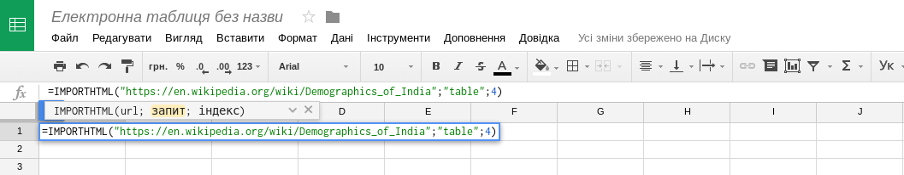

В результаті чого ми присвоюємо цій комірці значення функції IMPORTHTML із заданими
параметрами, і функція витягає в нашу електронну таблицю четверту
таблицю зі сторінки на вікіпедії про демографію Індії.

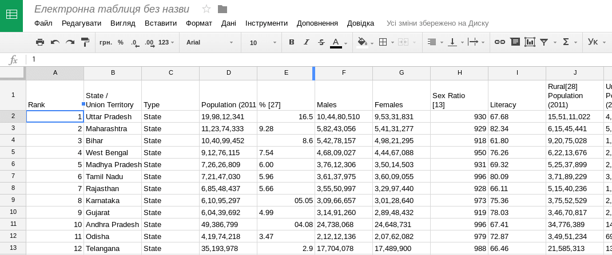

У випадках, коли дані на сторінці добре структуровані, функція `IMPORTHTML`
суттєво полегшує життя і дозволяє швидко перейти власне до аналізу
даних.

### Kimono
Досить популярний в минулому сервіс скрейпінгу даних —
Kimono — у 2016 році припинив функціонування,
але десктопну версію (для Windows і MacOS)
можна завантажити на комп’ютер і використовувати локально:
[www.kimonolabs.com/desktop](https://www.kimonolabs.com/desktop)

Дуже докладна стаття про Kimono з прикладами та скріншотами
(російською мовою): [medium.com/data-journalism/kimono-4a60158a0d70](https://medium.com/data-journalism/kimono-4a60158a0d70)

### Import.io
Програма [Import.io](http://import.io)
дозволяє витягувати дані зі сторінок в Інтернеті і зберігати їх в
таблицю або в файл з даними для подальшого використання.
Cервіс import.io має спрощену версію — magic.import.io,
де досить ввести лише посилання на сторінку з потрібними даними.

Інструмент безкоштовний (для не більш ніж 10 000 запитів на місяць), для
його використання потрібна реєстрація, також можна використовувати за
допомогою облікового запису в Фейсбуці, Google+ або в деяких інших
соціальних мережах.

### Розширення браузера Chrome Scraper і Firefox DataScraper
Розширення для браузера Google Chrome (споріднених з ним Chromium, Iron тощо)
[Scraper](http://mnmldave.github.io/scraper/)
перетворює дані з веб-сторінки на електронну таблицю.

Встановивши розширення, перейдіть на URL, дані з якого треба витягти.
Виділіть текст, який треба перетворити на таблицю,
і в контекстному меню, що викликається правою кнопкою миші,
виберіть пункт «Scrape similar…»
Якщо програма вихопила не зовсім те, що треба,
можна редагувати значення
XPath^[Мова виразів, для визначення частини XML документа, або для обчислення величин (наприклад, рядкових, числових або булевих) на основі вмісту XML документа]
до досягнення потрібного результату.
Отримані дані можна експортувати до Google Sheet.

Розширення [DataScraper](https://addons.mozilla.org/en-US/firefox/addon/datascraper/)
для Firefox працює подібним чином, але замість XPath використовує селектори
JQuery^[Поширена бібліотека для побудови динамічних вебсторінок].

### Розробницькі інструменти браузера

Іноді неможливість скопіювати дані зі сторінки як такої,
можливо обійти, звернувшись до її вихідного кода. 
Всі браузери підтримують можливість його перегляду як безпосередньо,
так і за допомогою розробницьких інструментів.

Досить часто веб-сторінки відображають дані,
отримані за допомогою скриптів з інших URL **у машиночитаній формі** —
(JSON, XML чи CSV), заповнюючи ними таблиці, мапи та інші конструкції.
В такому випадку хорошою альтернативою скрейпінгу цих даних є перехоплення 
відповідних потоків інформації, їх можна проглянути за допомогою вкладки «Network»
розробницьких інструментів.
Сортування за розміром, найменування, тощо,
можуть допомогти знайти серед скриптів той, що отримує потрібні дані.
Далі можна скористатися вкладкою «response» для копіювання цих даних
безпосередньо в текстовий редактор.

### Інші засоби скрейпінгу
Різноманіття інструментів скрейпінгу дуже велике,
і залежить лише від фантазії, технічної підготовки, наявного часу та натхнення.
Дамо лише декілька посилань на матеріали за цією цікавою темою:

+ Як отримати дані з Інтернету (частина посібника «Журналістика даних»)
  [texty.org.ua/pg/chapter/newsmaker/read/40161/42409](http://texty.org.ua/pg/chapter/newsmaker/read/40161/42409);
+ Інструменти для журналістики даних, частина 1: витягання та скрейпінг даних:
  [blog.silk.co/post/142737643047/data-journalism-tools-part-1-extracting-and](http://blog.silk.co/post/142737643047/data-journalism-tools-part-1-extracting-and) (англійською мовою);
+ Скрейпінг для журналістів
  [leanpub.com/scrapingforjournalists](https://leanpub.com/scrapingforjournalists)  (англійською мовою);
<!-- схоже, що статтю видалено з сервера (не працюють внутрішні посилання на неї)
+ Стаття на сайті «Журналистика данных»
  [datadrivenjournalism.ru/2015/03/scraping/](http://www.datadrivenjournalism.ru/2015/03/scraping/)
  (2015 рік, деякі інструменти можуть вже застаріти — російською мовою). -->

### Імпорт даних з вебу за допомогою Екселя

Окрім способів імпорту даних з Інтернету за допомогою різних
інструментів веб-скрейпінгу, описаних у попередньому підрозділі,
імпортувати дані з вебу можна і за допомогою найпопулярнішої програми
електронних таблиць — Microsoft Excel.

Звісно, імпорт даних за допомогою вбудованих можливостей Excel має свої
обмеження (наприклад складність роботи з багатосторінковими
документами), але для деяких завдань, і для тих, хто звик працювати з
програмою Excel, він може бути досить зручним.

Щоб імпортувати дані в таблицю Excel, виберіть команду **From Web** (з
вебу) в розділі **Get External Data **(Отримання зовнішніх даних) на
вкладці **Data** (Дані).

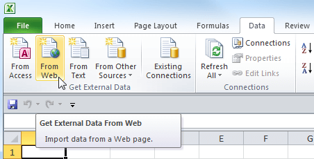

У діалоговому вікні введіть адресу веб-сайту, з якого потрібно
імпортувати дані і натисніть **Go** (Пуск). Сторінка буде завантажена в
це же вікно для попереднього перегляду, її можна погортати і знайти
потрібну інформацію.

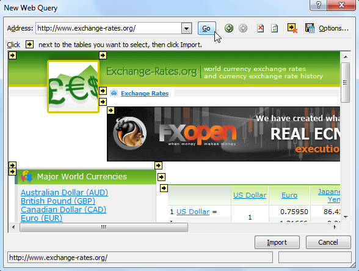

Перед кожною з web-таблиць є маленька стрілочка, яка вказує, що ця
таблиця може бути імпортована в Excel. Клацніть по ній, щоб вибрати дані
для завантаження, а потім натисніть **Import** (Імпорт).

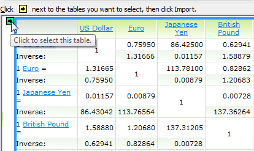

З'явиться повідомлення **Downloading** (Завантаження) — це означає, що
Excel імпортує дані з зазначеної web-сторінки.

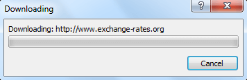

Виберіть клітинку, в якій будуть розміщені дані з інтернету, і натисніть
**ОК.**

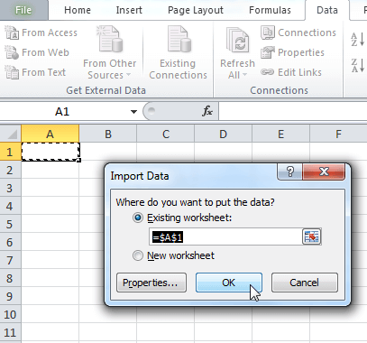

У вибраній комірці з'явиться системне повідомлення про те, що Excel
імпортує дані.

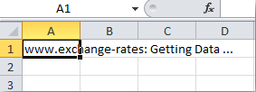

Через деякий час інформація з обраної web-сторінки з'явиться в таблиці
Excel.

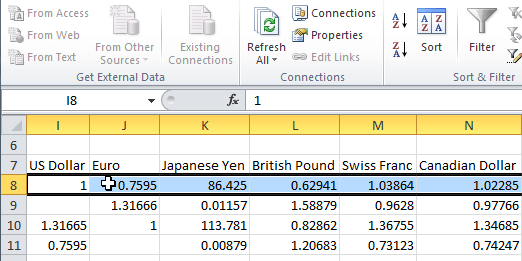

Імпортовані дані можна використовувати так само, як і будь-яку іншу
інформацію в Excel. Їх можна використовувати для побудови графіків,
спарклайнів (міні-графіків), формул.

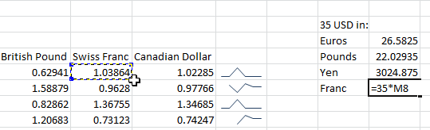

Один з плюсів імпорту даних з вебу в Excel — це можливість оновлення
даних прямо в самій програмі. Так, достатньо натиснути команду **Refresh
All** (Оновити все) на вкладці **Data** (Дані), і ця дія відправить
запит web-сторінці і, якщо є більш свіжа версія даних, запустить процес
оновлення в таблиці.

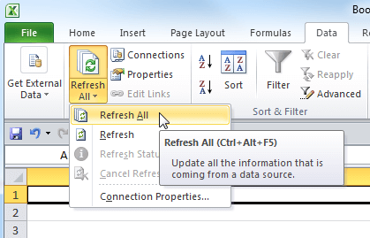

Якщо ж потрібно, щоб інформація в таблиці автоматично оновлювалася з
якоюсь заданою періодичністю, виберіть елемент таблиці, що містить
динамічні дані, і натисніть команду **Properties** (Властивості) в
розділі **Connections **(Підключення) на вкладці **Data** (Дані).

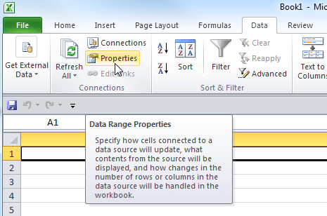

У діалоговому вікні поставте галочку **Refresh every** (Оновлювати
кожні) і вкажіть частоту оновлення в хвилинах. За замовчуванням Excel
автоматично оновлює дані кожні 60 хвилин, але Ви можете встановити
будь-який проміжок часу. Або, наприклад, вказати Excel оновлювати
інформацію кожен раз при відкритті файлу.

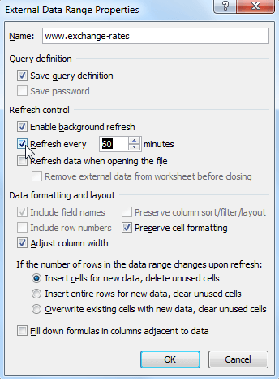

**Корисні посилання**

+ Отримання зовнішніх даних із веб-сторінки (українською мовою):
  [goo.gl/HbsLFB](http://goo.gl/HbsLFB)
+ Імпорт даних в Excel 2010 з Інтернету (російською мовою):
  http://office-guru.ru/excel/import-dannyh-v-excel-2010-iz-interneta-85.html
+ Використання веб-запитів для імпорту даних в Excel (російською мовою, коротко):
  [goo.gl/EvL4w5](http://goo.gl/EvL4w5)


## Очищення даних

Навіть записуючи дані на папірці, важливо дотримуватися тих самих конвенцій в усіх записах,
інакше можна прийти до непередбачуваних помилок (переплутані одиниці виміру, тощо).
Для даних, призначених до машинної обробки, це ще важливіше.
Дуже часто дані (це можуть бути дані, що описують ті самі чи подібні явища),
зібрані з різних джерел можуть бути записані по різному, відтак
у зведеній таблиці вони будуть «брудними».

На жаль, в Україні таке трапляється і з даними,
що походять навіть з одної державної інституції
(ті самі характеристики різні оператори можуть записувати по-різному).
Процес приведення машиночитаних даних до робочого, впорядкованого стану,
називається **очищенням даних**.


### Що таке чисті дані?
Чистими можна вважати дані, які:

-   не містять помилок та одруківок;
-   в межах одного типу чи класу мають уніфікований формат: дати
    зазначаються у єдиному форматі (скажімо 2015-01-01), числа мають
    однаковий роздільник для десяткових (або кома, або крапка, в одному
    наборі даних не має зустрічатись два різних роздільника десяткових);
-   назви всюди пишуться однаково (однаковий варіант напису однієї і тої
    ж адреси, номеру телефону, ПІБу людини тощо);
-   в одній комірці міститься лише один запис, і кожен запис займає лише
    одну комірку (тобто у наборі немає об’єднаних комірок).
    
Table: Приклад брудних даних

Дата          Місто     Показник
------------  --------  --------------------
2015-08-01    Київ      1 678 910
01-07-2015    Киев      1,567,890
1 черв 2015   Кийів     1 млн 456 тис 789
2015.06.01    Львів     1.345.678
2015/07/01    Львов     1 234 567

З брудними даними неможливо працювати: в них присутній часовий вимір,
однак ми не зможемо вибудувати часову лінію, оскільки всі дати мають
різний формат; тут присутній географічний вимір, однак ми не зможемо
агрегувати дані за змінною «Місто», оскільки кожен раз назва міста
пишеться інакше; тут також присутній числовий показник, однак ми не
зможемо здійснювати над ним ніяких арифметичних операцій, оскільки всі
числа записані у різних форматах.

Table: Ті самі дані після очищення

Дата          Місто     Показник
------------  --------  -------------
2015-08-01    Київ      1678910
2015-07-01    Київ      1567890
2015-06-01    Київ      1456789 
2015-06-01    Львів     1345678
2015-07-01    Львів     1234567

Чисті дані ми можемо фільтрувати, сортувати, здійснювати над ними
арифметичні операції, візуалізувати та будувати на їх основі сервіси.

Найпростіший спосіб очистити дані —
використати вбудовані функції електронної таблиці (наприклад, Excel
або Google Spreadsheets). 
Для багатьох випадків неправильно поданих даних
досить використання команди пошуку і заміни (Find & Replace).
Так можна прибрати зайві пробіли у значеннях,
помилкові символи, та інші прості патерни.

Для об'єднання вмісту двох комірок можна використати формулу CONCATENATE,
наприклад, `=CONCATENATE(A2," ",A3)`
виведе вміст другої і третьої комірок в першій колонці, розділивши їх пробілом.

Для розділення комірок до різних колонок використовуючи певний символ-роздільник,
наприклад, кому, можна використати формулу SPLIT:
`=SPLIT(A2,", ",false)`

Але часто буває, що масив даних занадто великий, або дані занадто
«брудні», щоби можна було обійтися простими засобами електронної таблиці.
В такому разі може стати у нагоді чудова програма **Open Refine**.

### Open Refine

[OpenRefine](http://openrefine.org/)
це інструмент для очищення даних, написаний на Java,
що виконується локально і працює всередині веб-браузера,
який запускається автоматично.

Open Refine дозволяє:

-   виявляти та виправляти помилки в даних, зокрема --- знаходити різні
    варіанти написання назв і дат та приводити їх до єдиного вигляду;
-   знаходити та видаляти зайві символи та комбінації символів у даних,
    в тому числі за допомоги регулярних виразів;
-   розбивати стовпчики за певним роздільником або ж навпаки об’єднувати
    дані із певним роздільником;
-   фільтрувати дані за кількома показниками;
-   виділяти/видаляти стовпчики, змінювати структуру документу;
-   конвертувати дані в різні формати;
-   здійснювати базовий аналіз даних;
-   надсилати запити до різних АРІ (наприклад, геокодувати адреси);
-   зберігати всі трансформації даних в окремому проекті та
    застосовувати їх до інших документів.
    


Відеоприклад — очищення даних, отриманих із сайту Верховної Ради (голосування
депутатів)
[youtube.com/Q3Xqz9VWNBE](https://www.youtube.com/embed/Q3Xqz9VWNBE)

В Open Refine використовуються *регулярні вирази* (Regular expressions) ---
стандартний засіб опису складних патернів для пошуку і заміни.
До них варто звернутися докладніше, оскільки вони наявні 
в багатьох інших програмах і мовах програмування,
і іншого засобу складних пошуків-замін можна вважати що немає.

