# 5. Візуалізація {.ws #ch4}

*У розділі розглядаються різні способи представлення даних,
але головну увагу приділено їхній візуалізації,
як засобу найшвидше донести певний висновок з даних
до кінцевого споживача інформації.*

Таблична форма представлення даних годиться для їх зберігання і обробки,
але вже на фазі аналізу ми використовуємо інші, графічні представлення даних,
наприклад діаграми розcіяння, графіки, гістограми та стовпчасті діаграми.
Графічна форма полегшує сприйняття інформації як цілого,
вочевиднює її особливості, тенденції та аномалії —
що цікаво не лише аналітикові, а й остаточному споживачеві.

Але кінцеві візуалізації від робочих з процесу аналізу
відрізняє не лише більша увага до охайності і естетичності.
Якщо в процесі аналізу ми *шукаємо* закономірності й цікаві виники,
в процесі кінцевої візуалізації
*ми (як правило) наперед знаємо, що хочемо показати*.
Ба навіть більше — ми знаємо, *які емоції ми хочемо викликати у споживача*,
що у наявних даних має його *вразити*.

Крім того, якщо робочі візуалізації зрозумілі для людини,
що підготована до сприйняття даних,
перебуває в певному контексті роботи з ними,
то кінцеві візуалізації мають *занурювати у контекст* непідготовану людину.

Методи розв'язку цих задач різноманітні,
і частина з них виходить за межі візуалізації даних.
Для занурення непідготовленої людини в контекст,
виділення в даних *«героя»*, тощо,
найчастіше використовуються засоби **інфографіки**,
яка, в свою чергу, може як включати елементи візуалізації даних,
так і обходитися цілковито без них,
*ілюструючи* певний набір даних,
а не *відображаючи* його.
Спробуймо розділити інфографіку і візуалізацію даних,
виділивши їхні засадничі відмінності.

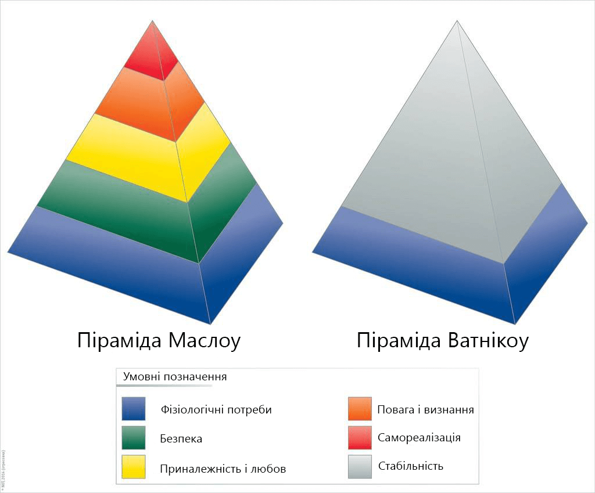

-----------------------------------------------------------------------------------
                           Візуалізація даних           Інфографіка
-------------------------  ---------------------------  ---------------------------
Спосіб створення           Автоматична генерація        Ручна робота із залученням
                           з набору даних               художника чи дизайнера

Залежність                 Мінімальна, ту саму          Повна, інший набір даних
від конкретного            візуалізацію можна           може викликати докорінну
набору даних               використовувати з            переробку чи інше рішення
                           різними наборами даних

Мета використання          Дати змогу сприймачеві       Проілюструвати висновки
                           зробити самостійні висновки  зроблені авторами,
                           чи переконатися в слушності  розказати задану наперед
                           висновків автора             історію
------------------------------------------------------------------------------------

В цьому посібнику ми не маємо на меті розглядати прийоми і методи
інфографіки, обмежившися заувагою, що під час її розробки
правильно зроблена візуалізація допоможе художникові чи дизайнеру
зрозуміти і осмислити дані аби знайти адекватне художнє рішення.
Візуалізація має передувати інфографіці.

## Задачі візуалізації

Як ми вже знаємо з досвіду використання візуалізації для аналізу даних,
візуальне сприйняття дуже ефективне.
Спробуймо окреслити задачі кінцевої, не для себе, а для читача/глядача робленої, візуалізації.

В першу чергу, візуалізація дозволяє охоплювати великі обсяги інформації,
наче стискаючи її, роблячи компактною.
Так само, вона дозволяє зробити доступнішим сприйняття складної інформації, 
пошвидшуючи порівняння величин і полегшуючи виявлення паттернів в даних.

Важливою рисою візуалізованих даних є їхня переконливість,
тому дуже важливо уникати викривлення інформації в процесі візуалізації.
Зокрема, в хорошій візуалізації наочність загальної картини не заважає сприйняттю деталей.

Але головне, що вирізняє візуалізацію як інфопродукт від використання
візуалізації як техніки аналізу — *чітке повідомлення*.
Якщо в даних нема нічого такого, що хотілося би в них показати сприймачеві,
жодна візуалізація не зможе зробити їх цікавими.

Відповідно, побудові візуалізації має передувати момент осяяння,
усвідомлення в даних чогось такого, що вони промовляють, чим варто поділитися.
Це може бути просто масштаб чогось, 
якась залежність, закономірність,
співвідношення, аномалія, тощо.
Іншими словами, в даних має з'явитися *герой* і вони мають стати його *пригодою*.

Далі, треба обрати метод візуалізації, годящий для донесення цього повідомлення.
Слід пам'ятати, що увага людини, опрацьовуючи патерни в полі уваги,
завжди розділяє патерн на дві сутності — *фігуру* і *тло*,
важливе і *те, серед чого воно важливе*.
За тривалого споглядання багатого на деталі патерна, можливий розпад його на субпатерни,
в кожному з яких так само відбувається знайдення фігури і тла.

В хорошій візуалізації «головний герой» одразу помітний і сприймається фігурою,
а його стосунки з тлом передають чи принаймні відтіняють головне повідомлення.
Тому різні повідомлення вимагають різних технік візуалізації.

Але якою б не була техніка візуалізації, говорити мають самі дані. 

## Техніки візуалізації

Технік візуалізації досить багато, і серед них трапляються дуже складні,
але для передачі багатьох повідомлень досить дуже простих технік,
інколи трохи доопрацьованих «по місцю».
Наприклад, віко-статева (популяційна, демографічна) піраміда, 
стандартний інструмент візуалізації даних про демографічні тенденції популяції
та порівняння популяцій, являє собою дві гістограми, поставлені вертикально
нулем до нуля.

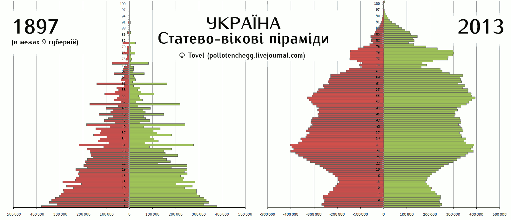

Неважко помітити, що ця візуалізація дозволяє швидко бачити
вікові і статеві дисбаланси в популяції а також миттєво оцінювати
співвідношення дітей, людей репродуктивного віку і старих.
Для більшості повідомлень на цю тему ця діаграма достатня.

Але для візуалізації таких самих демографічних даних іноді використовуються і складніші
діаграми, аж до тривимірних графіків, не факт, що наочніших за віко-статеву піраміду.

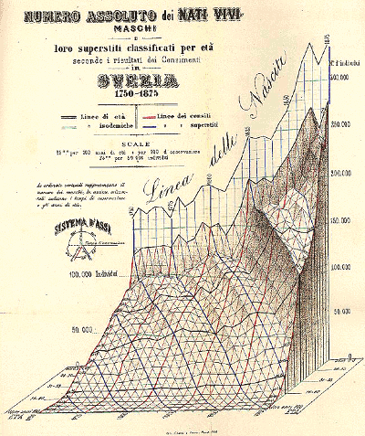

За всієї поваги до історичної значущості наведеної вище схеми,
читати її непросто, і сприймається вона дуже не одразу.

Таким чином, можна твердити, що пошук правильної техніки варто починати від простіших,
і тільки якщо вони не передають потрібну ідею,
переходити до складніших.

### Гістограми 

Гістограма показує розподіл значень в множині об'єктів.
На одній осі, як правило, горизонтальній, ми відкладаємо значення,
а на вертикальній — показуємо, скільком об'єктам у множині воно відповідає.
Оскільки кількість об'єктів — натуральне число,
гістограми завжди будують від нуля.

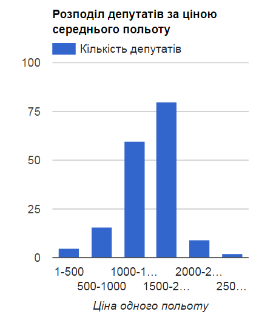

За виглядом гістограми можуть бути стовпчастими або лінійними,
що зближає їх із стовпчастими та лінійними діаграмами. 

### Стовпчасті діаграми

У звичайній стовпчастій діаграмі, призначеній для порівняння кількох значень,
значуща лише одна вісь, а вздовж іншої розташовано стовпчики зручної для сприйняття ширини,
висота яких кодує значення. Стовпчасті діаграми часто будують не від нуля.

Складнішим різновидом стовпчастої діаграми є 
Стовпчаста діаграма зі змінною шириною стовпчиків, де ширина стовпчиків не є фіксованою,
а кодує другу змінну.
Проблемою такої діаграми можна назвати те, що якщо співвідношення за одною змінною
оцінювані легко, то другу ми сприймаємо опосередковано площею стовпчиків.
Відповідно, якщо обидві змінних дають спільний ефект, цей тип діаграми годиться,
а якщо змінні і їхній вплив незалежні, то ні.

Ще складніший варіант стовпчастої діаграми — стосова.
В ній кожен стовпчик складається з шарів, товщина кожного з яких кодує змінну,
сума яких становить певне значуще ціле. 

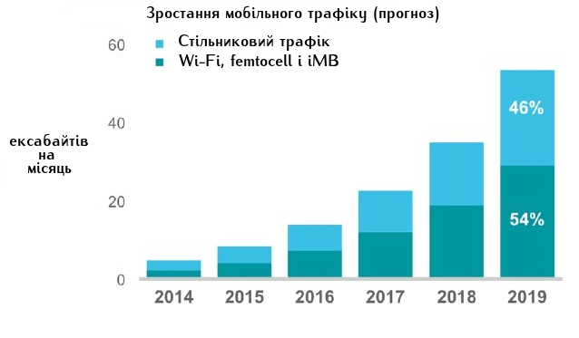

Існує форма стосової діаграми, коли всі стовпчики мають рівну висоту —
тоді вона показує лише різний розподіл між змінними між об'єктами-стовпчиками.

### Лінійні діаграми (графіки), діаграми розсіяння і бульбашкові діаграми

Знайома з шкільного курсу алгебри  декартова система координат,
є одним із найпотужніших інструментів візуалізації даних.
Просте розміщення точок даних в координатній сітці дає *діаграму розсіяння*,
яка, будучи зручним інструментом пошуку кореляції під час аналізу,
може бути адекватним засобом візуалізації даних, в яких треба показати як тенденцію,
так і типові відхилення від неї. 

Якщо треба показати те, як експериментальні дані відповідають чи відхиляються
від теоретичної (обчисленої) кривої, до точок додають «вуса», що показують
межі імовірної похибки або будують експериментальну криву, яка є смугою,
що її ширина дорівнює похибці виміру.

Якщо точок дуже багато і тенденція чітка,
лишається власне лінія, і це називається *лінійною діаграмою*.
В лінійних діаграмах можна поєднувати декілька ліній,
що дуже зручно для порівняння параметрів кількох подібних об'єктів.
Кодування ліній виконується кольором або різними пунктирами.
Але важливо не перевантажувати діаграму — 
для більше ніж чотирьох ліній краще сприйматиметься кілька менших графіків,
поданих поруч в одному масштабі.

Якщо треба показати залежності трьох змінних,
точки на діаграмі розсіяння заміняють на кола, діаметр яких кодує додаткову змінну.
Важливо правильно обрати масштаб для цієї змінної: 
різниці в діаметрі мають бути помітними,
але кола не мають ставати завеликими,
щоби не заважати сприйняттю позицій своїх центрів у координатній площині.

### Колові діаграми.

Аналогічно до поділу на частини стовпчиків в стосовій діаграмі,
кола можна ділити на сектори, щоби показати частки у цілому.
Така «тортова» діаграма добре передає співвідношення кількох значних часток,
але стає неефективною, якщо часток дуже багато.
Тоді варто об'єднати дрібні частки в групу «інші».

### Таблиця як техніка візуалізації

Говорячи раніше про оптимізацію структури даних,
ми вже розглядали таблиці як засіб *візуалізації даних*.
Справді, належним чином побудована таблиця може дуже ефективно унаочнювати певні властивості даних.
Важко давати загальні поради щодо організації таких таблиць,
кожен окремий випадок може потребувати спеціального рішення,
але деякі принципи досить-таки прості, хоча не абсолютні.

- **Заголовок містить згадку основної змінної**, іншими словами, якщо у таблиці є «головний герой», він має бути присутній в заголовку.
- **Одиниці виміру в заголовку чи заголовкових комірках у шапці чи боковику**, іншими словами, в комірках мають бути саме значення.
- **Об'єднані комірки в шапці чи боковику** мають відбивати структуру даних.
- **Таблиця не має бути переускладненою та завеликою**, краще подати декілька простих табличок, 
  а якщо неможливо уникнути значного розміру таблиці, слід дублювати шапку на кожній сторінці
  і вводити елементи візуального структурування, наприклад, підзаголовки в об'єднаних рядках.
- **Комірки не зобов'язані містити цифри чи слова** — таблиця може бути носієм простих діаграм, графіків і гістограм,
  крім того, використання піктограм в таблиці може пришвидшити її сприйняття.

Оформлення таблиці як засобу візуалізації може бути дуже різноманітним,
але слід уникати зайвих ліній — достатня відбивка білим простором
і лінії, що відокремлюють шапку і боковик від даних.
Вирівнювання тексту в таблиці варто робити по лівому краю, 
але якщо ми маємо багато числових значень, що відрізняються на кілька розрядів,
їх варто вирівнювати по правому краю, або, якщо вони є десятковими дробами,
за десятковим символом.

Грамотно і лаконічно побудовані таблиці легко сприймаються і прикрашають сторінку.
Якщо око «намагається оминути» вашу таблицю, перевірте, чи все з нею гаразд,
чи не переобтяжена вона зайвими графічними елементами,
чи достатні відбивки, тощо.

### Інші техніки візуалізації 

Існує ще багато технік візуалізації — від досить строгих, як Ейлерові кола
та споріднені з ними діаграми Венна,
що використовуються для унаочнення стосунків множин
і їх перетинів до екзотики типу *личок Чернова*,
інформація про практичну користь яких досить неоднозначна.
Для демонстрації структур і залежностей використовуються *графи* і *організаційні діаграми*.
Для деяких візуалізацій доречно використати не декартові координати,
а, наприклад, полярні.

## Вибір техніки візуалізації

Для вибору належної техніки візуалізації — 
такої, щоби вона унаочнювала саме ту властивість даних,
яку хочеться показати сприймачеві —
продуктивно скористатися класифікацією
з діаграми Джина Желязни.
Техніки візуалізації в ній організовано у дерево,
коренем якого виступає питання «що ми хочемо показати?».

Table: Що ми хочемо показати?

  --------------------------- ------------------- ----------------------------------------------- ------------------------------------------------
  **Розподіл**                **Одна змінна**     Небагато точок даних / категорій / інтервалів   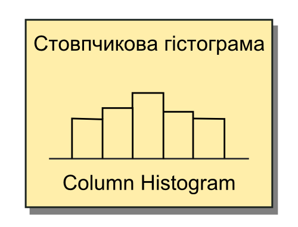

  **Розподіл**                **Одна змінна**     Багато точок даних                              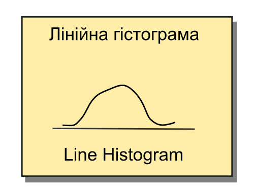

  **Розподіл**                **Дві змінні**      \                                               
  
  **Розподіл**                **Три змінні**      \                                               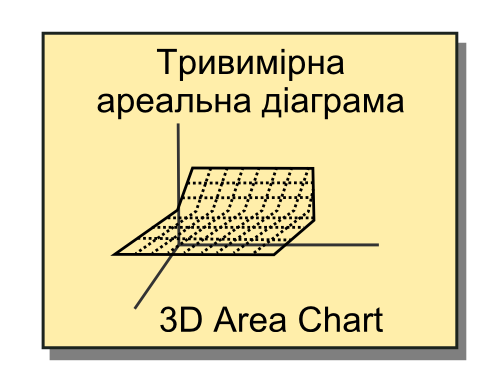

  **Композицію (будову)**     Статичну            Проста частина в цілому                         

  **Композицію (будову)**     Статичну            Компоненти компонентів                          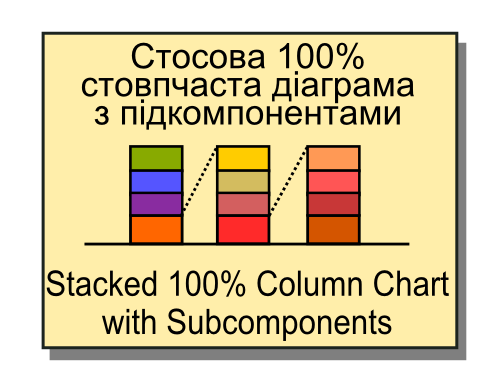

  **Композицію (будову)**     Статичну            Накопиченя додавань і віднімань в цілому        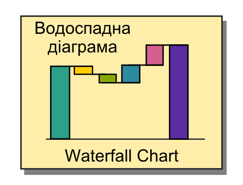

  **Зміну протягом часу**     Небагато періодів   Важливі тільки відносні відмінності.            

  **Зміну протягом часу**     Небагато періодів   Важливі і абсолютні, і відностні відмінності    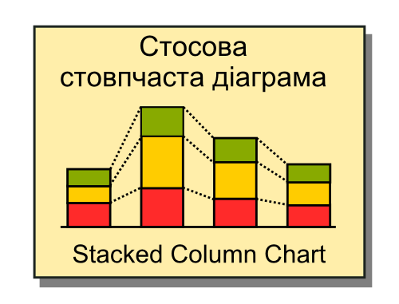

  **Зміну протягом часу**     Багато періодів     Важливі тільки відносні відмінності             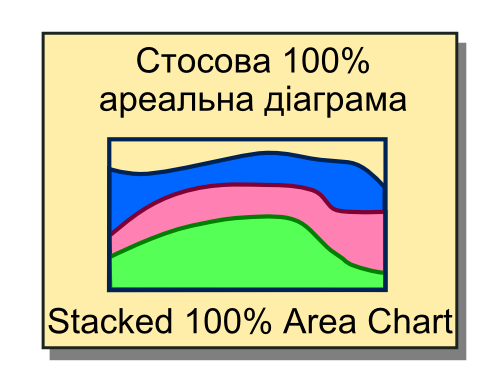

  **Зміну протягом часу**     Багато періодів     Важливі і абсолютні, і відносні відмінності     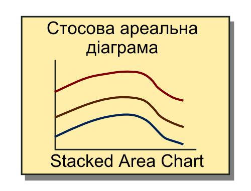

  **Зв’язок чи залежність**   Двох змінних        \                                               

  **Зв’язок чи залежність**   Трьох змінних       \                                               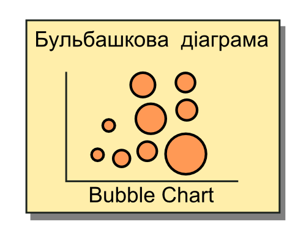

  **Порівняння**              В часі              Багато періодів — циклічні дані                 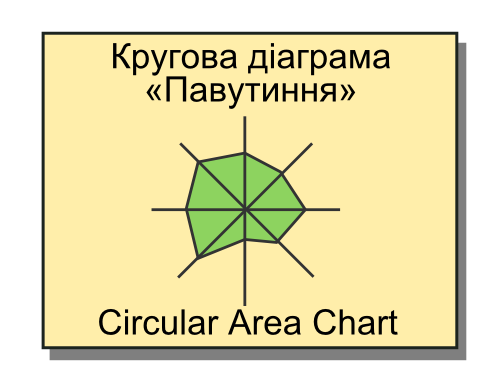
  
  **Порівняння**              В часі              Багато періодів — ациклічні дані                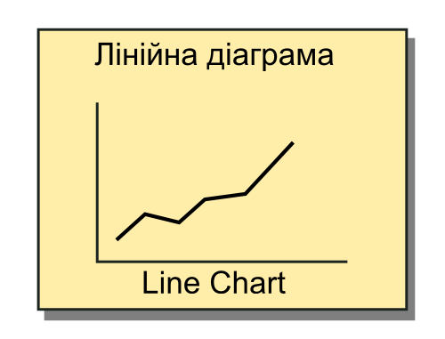
  
  **Порівняння**              В часі              Мало періодів,                                  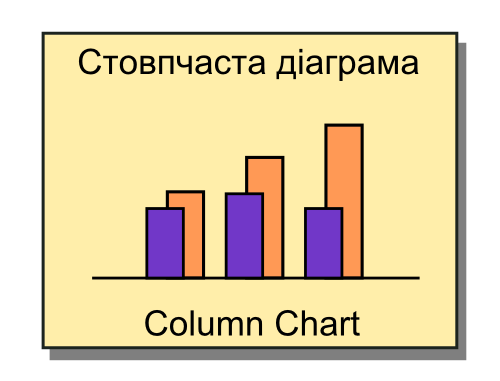
                                                  одна чи декілька категорій
  
  **Порівняння**              В часі              Мало періодів,                                  
                                                  багато категорій
                                                    
  **Порівняння**              Між об’єктами       Дві змінні на об’єкт                            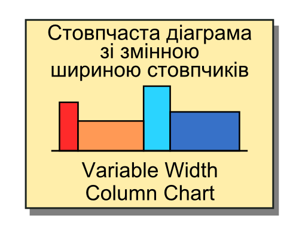

  **Порівняння**              Між об’єктами       Одна змінна на об’єкт,                          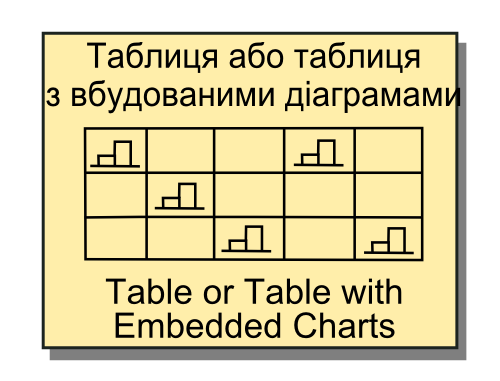
                                                  багато категорій

  **Порівняння**              Між об’єктами       Одна змінна на об’єкт,                          
                                                  мало категорій,
                                                  багато об'єктів
  
  **Порівняння**              Між об’єктами       Одна змінна на об’єкт,                          
                                                  мало категорій,
                                                  мало об'єктів

  --------------------------- ------------------- ----------------------------------------------- ------------------------------------------------

## Інструменти візуалізації

Прості засоби візуалізації включено до сучасних електронних таблиць.
Вони не охоплюють всього різноманіття технік,
але для простих задач і оперативного прототипування цілком годяться.

Деякі засоби побудови діаграм вбудовано до графічних пакетів,
як от Adobe Illustrator.
Якщо кінцева візуалізація мислиться графічно інтенсивною,
варто звернути на них увагу.
Іллюстраторні діаграми підтримують колові, стовпчасті та деякі інші діаграми,
із включенням графічних примітивів (наприклад, заміна прямокутного стовпчика
на фігурний)
і забезпечують оперативну перемальовку діаграми-шаблона 
заміною файла даних з роздільниками-табуляторами.

Але для побудови якісних візуалізацій
краще використовувати спеціалізовані інструменти,
тим більше, що серед них є вільні і досить прості в використанні.
Розпочнімо огляд з інструментів з низьким порогом входу.

RAW
:   Онлайн-сервіс швидкої візуалізації даних.
    Дозволяє швидко будувати досить екзотичні діаграми,
    зокрема bump chart, alluvial chart, streamgraph, тощо.
    Дані можна завантажити з кліпбоарду як CSV, обрати тип візуалізації
    і прив'язку змінних до наявних способів кодування інформації.
    Далі можливе тонше налагодження кольорів, розмірів та специфічних для поточного типу діаграми параметрів.
    Результат може бути експортований у SVG для подальшої обробки в Inkscape чи Illustrator,
    в зображення PNG або в об'єкт JSON.
:   [app.raw.densitydesign.org](http://app.raw.densitydesign.org)

Chartbuilder
:   Дуже простий у використанні інструмент, що приймає дані у JSON або копіюванням (роздільник — табулятор).
    Будує прості XY графіки. Експортує у PNG, SVG і JSON.
:   [quartz.github.io/Chartbuilder/](https://quartz.github.io/Chartbuilder/)

Silk
:   Платформа *публікації* даних із можливостями обробки і візуалізації.
:   [silk.co/product](https://www.silk.co/product)

Tableau Public
:   Десктопна програма для Windows та MacOS,
    призначена для створення інтерактивних комбінованих візуалізацій
    *без необхідності програмувати чи малювати*.
    Має безплатну версію, за використання якої «воркбуки» зберігаються тільки на серверах Tableau.
    У програми велике ком'юніті.
:   [tableau.com](http://www.tableau.com/)

Quadrigram
:   Сервіс побудови інтерактивних сторінок з тексту, зображень і діаграм.
:   [quadrigram.com](http://www.quadrigram.com/)

<!-- місце, де має бути про R і про D3 і про все, коли допишеться  -->

     