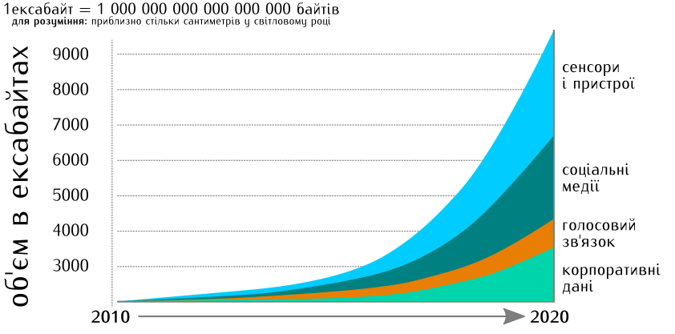

# 1. Збирання і джерела даних  {.ws #ch1}
*У розділі розглядаються джерела даних,
зокрема дається загальне поняття про збирання та збереження даних.
Читач зустрічається з проблемою знайдення джерела даних
і отримання даних з джерела.*

У збиранні й використанні даних нема нічого надзвичайного —
в побуті ми всі потроху дослідники і часом аналітики.
Задачу купівлі черешень на базарі
можна розглядати як підзадачі
1) обхода базару зі збиранням знань про вигляд і пропоновану ціну;
2) аналізу отриманих даних за співвідношенням ціна/якість;
3) власне купівлю.
Але мало які дані можна отримати настільки просто.
Нескладно самому опитати про ціни всіх продавців на базарі,
але вже всі базари міста стануть серйозним викликом,
не кажучи про всі базари країни.

Тому збиранням, аналізом і використанням даних,
як правило, займаються *групи людей* —
від самоорганізовних активістських і дослідницьких груп
до потужних державних і корпоративних інституцій.
Ця робота може бути як спеціально організованим дослідженням,
так і результатом обліку в процесі господарчої чи адміністративної діяльності.
Її результати можуть як використовуватися всередині груп чи організацій,
так і передаватися іншим групам чи організаціям для подальшої обробки і використання,
аж до випадку публічно доступних **відкритих даних**.

Завдяки цьому, маючи намір вивчити і опрацювати дані про певне явище,
можна спершу спробувати знайти їх у загальному доступі,
потім, якщо їх там немає, звернутися з запитом до відповідних організацій,
що мусять їх мати,
і лише за недоступності їх у такий спосіб,
думати над організацією спеціального дослідження.

Проте, яким би не було джерело даних,
спостереження, в результаті яких утворено ці дані,
мають спільні властивості,
які необхідно знати і враховувати.

## Суцільні та вибіркові спостереження, вибірка і похибка

**Суцільне спостереження**
передбачає обстеження усіх без винятку одиниць *генеральної сукупності*. 

Суцільні спостереження типові для дослідження відносно малих груп —
в невеликій організації простіше опитати всіх працівників,
ніж будувати вибірки. 
Такі спостереження можуть мати тривалий в часі характер,
як от ведення традиційного класного журналу,
куди методично і щоденно збирається інформація про відвідуваність
та оцінки з усіх дисциплін, що вивчаються,
для кожного з учнів цього конкретного класу.

Великі бюрократичні структури, зокрема державні органи,
можуть організовувати суцільні спостереження значно більшого масштабу.
Прикладами таких спостережень можуть бути *переписи населення*,
реєстрація народжень, смертей, шлюбів і розлучень органами реєстрації актів цивільного стану,
реєстрація транспортних засобів, прав власності, видача паспортів, тощо.

Слід зазначити, що досить часто навіть задумані та проведені як суцільні,
спостереження не охоплюють всі 100% генеральної сукупності — 
наприклад, не всі родини перебувають в зареєстрованому шлюбі,
не всі мешканці міста зареєстровані, як такі що в ньому проживають, 
далеко не всі фактичні власники майна реєструють це майно на себе,
тощо.

> Генеральна (загальна) сукупність (англ. Population)
:  сукупність усіх тих людей, організацій, ситуацій, документів або предметів,
   для яких мають справджуватися результати дослідження.
   *(О. Богдан «Що треба знати про соціологію та соціальні дослідження»)*, або стосовно яких дослідник планує робити висновки, вивчаючи певну проблему.

Якщо повернутися до побутового прикладу з купівлею черешень на ринку,
то *генеральною сукупністю* в цьому випадку будуть
усі продавці черешень на саме цьому ринку.
Але мало хто має час і натхнення ретельно обходити всіх продавців з потрібним товаром.
Частіше після якоїсь кількості питань результати починають повторюватися,
і покупець переходить до вибору достаньо якісного товару за прийнятною ціною.
Інакше кажучи, обмежується **вибірковим дослідженням**,
визначивши вибірку інтуїтивно.
В реальних дослідженнях ставленння до вибірки значно серйозніше.

> Вибірка, вибіркова сукупність (англ. Sample) — 
>:  це сукупність тих людей, документів, організацій, предметів, територій або ситуацій,
   які були відібрані за чітко визначеною процедурою для участі в дослідженні
   (якщо йдеться про людей) або безпосереднього вивчення в дослідженні
   (якщо йдеться про документи, предмети, організації, території та ситуації)
>
>  *(О. Богдан «Що треба знати про соціологію та соціальні дослідження»)*

Вибіркові спостереження не лише менш ресурсомісткі,
але й, у багатьох випадках, єдино можливі.
Здійснюючи спостереження, дослідник взаємодіє з досліджуваним об'єктом,
чим змінює його властивості.
Така зміна може бути незначною, а може бути драстичною.
Наприклад, для оцінки смакових якостей черешень, покупець куштує кілька ягід.
Він в принципі не може вдаватися до суцільного спостереження,
ба навіть до побудови серйозної вибірки,
не здійснивши купівлі.

> Репрезентативна вибірка —
> :   (від англ. represent – представляти) –  
>    сукупність, вивчення якої дає можливість поширити як якісні, так і кількісні
>    результати її дослідження на певну генеральну сукупність.
>    Для забезпечення репрезентативності
>    важлива не лише кількість одиниць у вибірковій сукупності,
>    а й те, як саме їх було відібрано.
>    Будь-яка репрезентативна вибірка є репрезентативною не взагалі,
>    а лише для конкретної сукупності. 
>
> Нерепрезентативна вибірка —
> :  вибіркова сукупність, вивчення якої дає можливість поширити лише якісні,
>   але не кількісні результати її дослідження на генеральну сукупність.
>
>    *(О. Богдан «Що треба знати про соціологію та соціальні дослідження»)*

Дані поділяються на *якісні* і *кількісні*.
Розрізняти їх дуже легко:
кількісні дані ми в той чи інший спосіб в тих чи інших одиницях *вимірюємо*,
а якісні дані ми лише занотовуємо чи позначаємо.
Це жодним чином не означає неважливості якісних даних — 
якісна інформація описує, які існують явища, які їхні різновиди,
чим вони відрізняються, які зв’язки вони утворюють між собою, тощо.
У цьому сенсі можна говорити, що якісна інформація репрезентує генеральну сукупність,
але не говорить нам про поширеність цих явищ у цій сукупності.

### Чому вибіркові спостереження працюють? Похибка вибірки.

В основі вибіркових спостережень лежать принцип подоби і закон великих чисел:
якщо з множини об'єктів із певним розподілом властивостей (генеральної сукупності)
ми **випадково** вибираємо підмножину об'єктів (вибірку),
то розподіл їхніх властивостей
тим більше співпадатиме з таким розподілом у генеральній сукупності,
чим більшою і чим випадковішою є вибірка.

В нашому базарному прикладі *нерепрезентативна* вибірка з кількох ягід 
дозволяє покупцеві зробити достатні висновки про смакові якості ягід
у кожного з продавців і зробити вибір.

Соціологи застосовують різні практичні способи і засоби для побудови
репрезентативних вибірок, розгляд яких виходить за межі тематики цього
посібника. При цьому, важливо, щоб громадські активісти, і, зокрема
журналісти --- розуміли хоча б у загальних рисах дані соціологічних
досліджень, могли критично ставитися до них, під час поширення тих чи
інших соціологічних даних.

Детальніше про те, що потрібно знати журналістам під час поширення результатів соціологічних досліджень
див. посібник від Фонду «Демократичні ініціативи» ---
«Опитування громадської думки» [(dif.org.ua/modules/pages/files/1337234689_1667.pdf)](http://www.dif.org.ua/modules/pages/files/1337234689_1667.pdf).
Ось цитата з цього посібника:

> **П’ять обов’язкових запитань,** що їх журналіст має поставити соціологові, котрий передає йому результати опитування: 
>
> 1. Скількох осіб було опитано? (Обсяг вибіркової сукупності). 
> 2. Хто (яка організація) здійснював опитування? 
> 3. Кого репрезентує опитана група населення? 
     (Населення країни загалом? Окремі області? Окремі міста або інші населені пункти?
     Певні верстви або соціальні групи населення?) 
> 4. Коли здійснювали опитування? (Терміни збирання інформації). 
> 5. Яка допустима (гранична) помилка випадкової вибірки?
     (Запитання про помилку репрезентативності).
> 
> Відповіді на ці основні запитання дають змогу правильно інтерпретувати дані опитування громадської думки.
Тому журналіст повинен не тільки дістати відповіді на них, а й повідомити їх читачеві (слухачеві),
супроводячи цією інформацією публіковані цифри --- змістові результати опитування.

Подоба між вибірковою та генеральною сукупністю має імовірнісну природу,
тому ми ніколи не можемо говорити про їхню тотожність,
а лише про ймовірність відповідності з певною похибкою.

<!-- тут була/буде вставка щодо-точності-та-похибки.md  -->

У соціальних дослідженнях склалася традиція базувати розрахунки на ймовірності 95%.
Отож, якщо ми читаємо, що 80% народу любить кататися на автомобілі з відкритим верхом,
за імовірності 0,95 і похибки 3,3%,
це означає, що з імовірністю 95% від 76,7% до 83,3% людей
не відмовляться від прогулянки на відкритій машині.
Іншими словами, ми не можемо виключити можливості,
що похибка була більшою, ніж вказано,
але ймовірність такої події дуже низька.

Для докладнішого ознайомлення з методикою проведення соціологічних досліджень
можна використати посібник-довідник
«Що варто знати про соціологію та соціальні дослідження»
Олени Богдан (Дух і Літера, 2015 — \
[ekmair.ukma.edu.ua/bitstream/handle/123456789/7700/Bogdan_SocResearch.pdf](http://ekmair.ukma.edu.ua/bitstream/handle/123456789/7700/Bogdan_SocResearch.pdf)),
звідки запозичено означення термінів у цьому розділі.

## Державні дані

В процесі своєї діяльності державні органи і структури збирають значні масиви даних.
Ці дані охоплюють багато аспектів соціального та економічного життя країни
(наприклад реєстрація майна, реєстрація проживання («прописка»),
реєстрація цивільних станів (народження, одруження, розлучення, смерть),
збирання податків і витрачання бюджетних коштів, проведення виборів, тощо).
Але найважливішою властивістю цих даних є те, що
відповідно до Закону України «Про доступ до публічної інформації»
[2939-17](http://zakon5.rada.gov.ua/laws/show/2939-17)
вони мають бути публічно доступними,
крім конфіденційної, службової та таємної інформації (стаття 6).

Закон передбачає кілька механізмів доступу громадян до даних,
зокрема це публікація даних в офіційних друкованих виданнях,
на офіційних веб-сайтах та єдиному державному веб-порталі відкритих даних
data.gov.ua
і надання інформації за запитами.

>#### щодо запитів {-}
В запиті треба якомога чіткіше вказати потрібну інформацію.
Зокрема, якщо відомо, що вона міститься в певному документі,
і відомі його навзва і реквізити, варто вказати їх.
Якщо вона розкидана по багатьох документах, 
варто формулювати запит саме як запит інформації
а не копій документів.
У разі якщо задоволення запиту на інформацію передбачає виготовлення
копій документів обсягом більш як 10 сторінок,
запитувач зобов'язаний відшкодувати фактичні витрати на копіювання та друк.
>
>В запиті на отримання інформації мають бути вказані контактні дані —
прізвище і ім'я запитувача (найменування — для юридичної особи),
адреса (поштова чи електронна), телефон (за наявності), тощо.
Цікаво що Закон не вимагає підтвердження справжності наведених прізвища і імені.
>
>Термін, в який розпорядник інформації має дати відповідь на запит,
5 днів, може скорочуватися,
якщо йдеться про інформацію, необхідну для захисту життя чи свободи особи,
інформацію щодо подій, що сталися чи можуть статися і загрожують безпеці громадян,
або подовжуватися (з наданням обґрунтування)
до 20 днів, якщо запит стосується великого обсягу інформації.

В реальності отримання масиву деперсоналізованих даних чи мікроданих
(зокрема, коли нас цікавить якийсь нестандартний набір показників)
шляхом запитів може бути досить ускладненим, або ж не увінчається успіхом загалом.
Так, державні установи можуть відповісти, що підготовка відповіді
«передбачає велику аналітичну роботу, і тому інформацію неможливо надати».
При цьому ми розуміємо, що для формування запитуваного нами масиву даних
державному службовцю досить зробити кілька простих маніпуляцій в електронній таблиці. 

Саме тому дуже важливо, щоб масиви максимально деталізованих ---
до такого рівня, щоб не порушувалися вимоги недоступу до особистої (конфіденційної) інформації ---
даних були доступними у форматі **відкритих даних**.
По-перше, це зменшує навантаження на державних службовців
(громадяни не надсилають так багато інформаційних запитів).
По-друге, це дає можливість кожному охочому проаналізувати
чи переструктурувати дані так, як це йому потрібно. 
 

##Відкриті дані

«Відкритість» — дуже важливе поняття,
що, попри позірну зрозумілість, не є аж таким простим.
Як термін у сполученнях
«відкриті дані» (open data),
«відкриті знання» (open knowlege),
«відкритий (вихідний) код» (open source),
«відкрите залізо» (open hardware),
тощо, означає цілий комплекс властивостей,
прав і обов'язків.
Докладному викладу цього комплекса
присвячено, зокрема, сайт [Open Definition](http://opendefinition.org/),
звідки ми запозичуємо наступне коротке означення:

> Відкрите —
:   таке, що **будь-хто** може
отримати до нього **вільний доступ**
і має право **використовувати**,
в тому числі **змінювати**
і **поширювати** його
з **будь-якою метою**
(належним чином зберігаючи зв'язок із джерелом і відкритість).

Для *відкритих даних* відкритість означатиме наступне:

1. Ці дані можна вільно і безкоштовно або за ціну копіювання отримати,
   в ідеалі — завантажити з інтернету;
2. Не існує дискримінації отримувачів даних за жодними ознаками;
3. Дані наявні в формі, що не ускладнює їх використання і обробку;
4. Немає обмежень на розповсюдження цих даних і результатів їх обробки,
   в тому числі із залученням даних з інших джерел;
5. У розповсюджених даних чи результатах обробки даних
   має бути вказане джерело походження і спосіб обробки.

Відкриті державні дані важливі не лише тим,
що забезпечують прозорість і демократичний контроль,
підвищують ефективність державних послуг,
сприяють поширенню інновацій — вони важливі і для економіки.
Тільки в ЄС, за даними досліджень, ринкова вартість відкритих даних становить десятки мільярдів євро,
адже вони дають ґрунт для нових приватних продуктів і послуг,
породжуючи нові знання  на основі комбінованих джерел інформації
і закономірностей великих обсягів даних.

Можна помітити, що вимоги законодавства України щодо доступу до публічної інформації,
наведені вище, зобов'язують державні структури виконувати частину вимог відкритості даних.
Але до справжньої реалізації принципів відкритості даних в Україні ще дуже далеко.
Зокрема, немає простого доступу до деперсоналізованих масивів мікроданих,
державна статистика не дає узагальнень на рівні нижчому за район, тощо.
Частина державних тримачів інформації повністю або частково ігнорує вимоги
щодо відкриття даних або виконує їх формально, викладаючи на портал data.gov.ua
інформацію в неструктурованих форматах, таких як  doc, docx, pdf і навіть зображеннях jpg.
Причин цьому багато --- зокрема, брак належної культури та компетенції, застарілі доелектронні процедури,
а часто і відсутність мотивації чи розуміння державними службовцями всіх переваг від грамотної роботи з даними
(в тому числі й для них самих). 

> Для успішності програми відкритих даних необхідно одночасно вживати
> скоординованих заходів на різних рівнях. Тім Бернерс-Лі, ініціатор
> створення Інституту відкритих даних Великої Британії, підсумував це
> таким чином:
>
> «відкриті дані починаються згори донизу, знизу догори, та зсередини
> назовні».
>
> + **Найвищий рівень** у цьому контексті --- це нормативно-правова база та
>   державна політика взагалі. Саме на цьому рівні встановлюються загальні
>   рамки й середовище для запровадження відкритих даних.
>
> + **Середній рівень** складається з галузевих міністерств і відомств та
>   наборів даних, якими вони володіють. На цьому рівні політичні рішення
>   перетворюються на операційні процеси та має місце їх практична
>   реалізація.
>
> + **Нижній рівень** --- це рівень виконання перших пілотних проектів щодо
>   оприлюднення та використання відкритих даних у співпраці між органами
>   влади, громадянським суспільством та бізнесом.
>
> Ключовими ініціативами, що реалізуються «знизу догори» та показують,
яких заходів мають вжити органи влади або яка нормативно-правова база
має бути прийнята, є невеликі пілотні проекти, в рамках яких органи
влади --- розпорядники даних та зовнішні зацікавлені сторони спільно
аналізують, як зробити запровадження відкритих даних ефективним. Так
само важливими є зміни у законодавстві, оскільки вони дозволяють
з’являтися новим ініціативам за принципом «знизу догори». Вживаючи
конкретних заходів, галузеві міністерства та відомства забезпечують
практичну реалізацію наявних політичних і правових основ та створюють
можливості для зацікавлених сторін зробити внесок у процес запровадження
відкритих даних. Реалізація ініціативи відкритих даних у значній мірі
передбачає навчання на власному досвіді – відтак, дуже важливо, щоб ці
заходи не планувалися та не розглядалися ізольовано один від одного, а в
контексті відповідних та взаємопов’язаних кроків на інших рівнях.
>
> *Зі звіту ПРООН («Оцінка готовності України до запровадження відкритих даних»)*
[dhrp.org.ua/uk/publikatsii1/1071-20160227-ua-publication](http://dhrp.org.ua/uk/publikatsii1/1071-20160227-ua-publication)

> Хороший огляд «Про стан розвитку відкритих даних в Україні» зробив також Олександр Краковецький (опубліковано 11 серпня 2016 р.):
[site.ua/alex.krakovetskiy/4667-pro-stan-rozvitku-vidkritih-danih-v-ukrayini](https://site.ua/alex.krakovetskiy/4667-pro-stan-rozvitku-vidkritih-danih-v-ukrayini/)
 
Щодо того, в яких форматах публікують відкриті дані,
а також того, як грамотно структурувати дані для публікації ---
у подальших розділах («Формати даних», «Що таке чисті дані»,
«Оптимізація структури даних», а також «Поширення відкритих даних»).

## Державна статистика та адміністративні дані
Державні дані поділяють на **державну статистику**
та **адміністративні дані**.

До системи *державної статистики* належать:

+ **Державна служба статистики України** --- [ukrstat.gov.ua](http://www.ukrstat.gov.ua/)
+ **Національний банк України** --- [bank.gov.ua](http://www.bank.gov.ua/)
+ **Державна фіскальна служба** --- [sfs.gov.ua](http://sfs.gov.ua/)
+ **Міністерство фінансів** --- [minfin.gov.ua](http://www.minfin.gov.ua/)

Дані, які генерують і збирають інші державні органи, називаються *«адміністративними даними»*.
Наприклад, дані Пенсійного фонду --- адміністративні дані,
а дані Державної фіскальної служби стосовно митних декларацій --- статистичні.

>Державна статистика,
>:   відповідно до Закону «Про державну статистику», —
>    централізована система збирання, опрацювання, аналізу,
>    поширення, збереження, захисту та використання статистичної інформації.
>
> Адміністративні дані —
> :  дані, отримані на підставі спостережень,
    проведених державними органами (за винятком органів державної
    статистики), органами місцевого самоврядування та іншими юридичними
    особами відповідно до законодавства та з метою виконання
    адміністративних обов'язків та завдань, віднесених до їх компетенції;
> *(Закон України «Про державну статистику»).*

Державна служба статистики України має мережу
територіально і функційно підпорядкованих одиниць,
що є виробниками статистичної інформації.
Вона опрацьовує фінансову статистику Національного банку України,
митну та податкову статистику Державної фіскальної
служби та статистику державних фінансів від міністерства фінансів.

Також Держстат виробляє статистичну інформацію на основі
інформації, надаваної підприємствами і організаціями,
зареєстрованими в ЄДРПОУ
(єдиному державному реєстрі підприємств і організацій України).

Органи державної статистики діють на підставі щорічного плану
і здійснюють статистичні спостереження за сталою методологією.
Важливо, що з планами і методологією державної статистики можна вільно ознайомитися на сайті Держстату
[ukrstat.gov.ua](http://www.ukrstat.gov.ua/).

> Статистичне спостереження —
>:   планомірний, науково організований процес збирання даних щодо масових
явищ та процесів, які відбуваються в економічній, соціальній та інших
сферах життя України та її регіонів, шляхом їх реєстрації
за спеціальною програмою, розробленою на основі статистичної методології.
>
> Статистична методологія —
>:   сукупність науково обґрунтованих способів,
правил і методів статистичного вивчення масових соціально-економічних явищ
та процесів, які встановлюють порядок збирання,
опрацювання і аналізу статистичної інформації.
>
> Статистична інформація —
> :    документована інформація,
що дає кількісну характеристику масових явищ та процесів,
які відбуваються в економічній,
соціальній, культурній та інших сферах життя суспільства.

В додатках наведено [перелік](#GovDataList) деяких корисних джерел державних даних.

## Великі дані (Big Data)

Вперше термін «великі дані» з'явився в науковому звіті NASA за 1997 рік,
і стосувався проблеми обробки і візуалізації наборів даних,
більших не лише за оперативну пам'ять, але і за доступний дисковий простір.
В тому ж документі єдиним ефективним методом подолання цієї проблеми
визнавалося подальше нарощування обчислювальних потужностей.

Як відомо, обчислювальні потужності зростають експоненційно (закон Мура),
отож згодом цей термін набув іншого значення.
Так називають величезні масиви даних,
що виникають внаслідок інформатизації економічної діяльності і повсякденного життя,
часто наповнювані автоматично, коли дані з сенсорів надходять одразу до баз даних. 
Сучасні системи банківських транзакцій,
обліку покупок (і покупців, що отримали дисконтні картки) в торговельних мережах,
біллінг операторів мобільного зв'язку,
соціальні мережі, тощо
творять вельми цікаві масиви структурованої інформації.
Як правило, такі дані мають точну часову і географічну прив'язку,
а частина цих даних персоналізована.
Кількість великих даних стрімко зростає,
і в перспективі розбудови *інтернету речей* зростатиме дедалі стрімкіше. 

Власницьке^[англ. proprietary] походження
і необхідність часткового відфільтровування інформації
(зокрема, належної деперсоналізації відповідно до законів про захист персональних даних)
обмежують відкритість великих даних.
Але сама їхня природа, що вимагає значних обчислювальних і аналітичних потужностей
а також вигоди, що їх обіцяє ефект синергії від використання даних з різних джерел,
спонукають до якнайбільшої відкритості.

Таким чином, ми стикаємося не лише з переходом кількості в якість,
але з набуттям даними недоступної раніше багатовимірності
та, в деяких випадках, доступності в реальному масштабі часу.
Наприклад, дані з транспондерів комерційних літаків —
а вони містять покази ключових приладів
(швидкість, висота, напрямок польоту, тощо)
та ідентифікацію борту і виконуваного рейсу — 
з одного боку, дають можливість метеорологам відстежувати рух повітряних потоків
всюди, де пролягають повітряні траси, а з другого —
дозволяють сервісам типу [FlightRadar24](flightradar24.com)
не просто показувати на мапах рух літаків у реальному часі,
а й розпізнавати за допомогою мобільного додатку,
що саме за борт, звідки і куди пролітає зараз в полі зору користувача.

<!-- [Відео про Flightradar24](https://www.youtube.com/watch?v=GmUBGCg8wIA) -->
<iframe width="560" height="315" src="https://www.youtube.com/embed/GmUBGCg8wIA" frameborder="0" allowfullscreen></iframe>

Кількість можливих використань великих даних
обмежена лише уявою користувача.
Мобільні оператори відслідковують місця найбільшого скупчення своїх абонентів — і відповідно до цього закуповують зовнішню рекламу.
Зчитуючи дані з гіроскопу та GPS смартфонів, що перебувають в машинах,
можна побудувати карту якості автомобільних доріг —
адже гіроскоп реагує на ями та нерівності.
[uaroads.com/](http://uaroads.com/)

> #### Аномалія у великих даних як привід для розслідування {.example}
> Інколи обробка великих даних дає несподівані результати.
> 
> Так, колектив сайту texty.org.ua, свого часу створив
[інтерактивну мапу](http://texty.org.ua/d/uz_first/)
пасажирських перевезень поїздами за 2014—2015 роки,
використовуючи базу даних проданих квитків Укрзалізниці.
>
> Згодом читач сайту звернув увагу на наявність
нерегулярного сполучення столичної станції,
яка зазвичай не приймає пасажирські поїзди — Київ-Дніпровський. 
Проведений додатковий аналіз, виявив, що станцій,
куди раптом з'являвся і потім зникав рух поїздів дальнього сполучення,
ще три — Київ-Московський, Святошин і Київ-Петрівка, 
а дати їхньої появи — 16, 23, 28 січня і 20 лютого 2014 року —
корелюють з подіями протистояння Майдану і тітушок.
На користь цієї гіпотези свідчили і станції відправлення —
Сімферополь, Донецьк, Луганськ, Херсон, Маріуполь, Харків-Пасажирський
> 
> Таким чином, виникло нове розслідування —
[«Янукович-тревел»](http://texty.org.ua/d/uz_maidan/),
значно цікавіше за початкове.

## Гуртове збирання і обробка (краудсорсинг) даних

Як вже зазначалося, збирання і обробка даних —
скоріше групова, аніж індивідуальна діяльність.
Проте, не для кожної задачі можливо і реально
створити відповідний формальний чи неформальний колектив,
і не для кожної задачі створений колектив буде ефективним.
Водночас, згуртовувані спільними проблемами чи обставинами,
люди можуть вирішувати проблеми швидше ніж окремі особи або малі групи.
Відповідно, можливо збирати дані,
використовуючи мережу самозалучених осіб.
Питання лише в тому, як вмотивувати їх ділитися даними
і в наданні їм відповідного інструментарію. 

Одним з варіантів є надання мобільного додатку,
що дозволяє користувачам *обмінюватися інформацією*,
або отримувати результати аналізу інформації.
Приклад з побудовою мапи стану шляхів, наведений вище,
можна розглядати і як приклад такої моделі краудсорсингу.

>#### щодо терміну «краудсорсинг» {-}
>Англійський термін краудсорсинг (crowdsourcing) — 
портмоне з «натовп» і «аутсорсинг»,
і означає передачу будь-якої роботи
попередньо невизначеній множині охочих.
Хоча цю практику прийнято розглядати то як
«перенесення методів розробки програмового забезпечення з відкритим вихідняком у позапрограмувальницьку діяльність»,
то навіть як
«використання принципів розподілених розрахунків з відкритими мережами і
паралельною обробкою у вирішенні практичних проблем в реальному світі
використовуючи реальних людей»,
реально вона стара як світ.
Наприклад, оголошення «розшукується небезпечний злодій» —
краудсорсинг роботи детектива.
Неважко згадати, що така форма залучення охочих часто передбачає значну винагороду.

Гуртом можна не лише збирати, але й обробляти дані.
Прикладом такої гуртової співтворчості може послугувати
діяльність [Канцелярської сотні](https://www.facebook.com/kancelaristy?),
зокрема проект declarations.com.ua.
Ось фрагмент із розділу «Про проект» цього сайту:

> Новий антикорупційний закон зобов’язує усіх чиновників, суддів, прокурорів,
депутатів – всіх «державних людей» --- заповнити та оприлюднити декларацію про доходи.
Новий люстраційний закон зобов’язує оприлюднити таку декларацію і всіх кандидатів на посади.
За приблизними підрахунками декларації заповнять і оприлюднять близько мільйона людей.
>
>І що? А нічого.
>
>Тому що ця публікація буде у формі викладеного файлу зі сканом паперової декларації,
заповненої від руки. І ці декларації будуть лежати на безлічі сайтів у непримітних розділах.
Навіть переглянути їх важко, не кажучи про аналіз.
>
>Ініціатива Канцелярська сотня прагне оцифрувати ці декларації,
а також декларації попередні років. По-справжньому оцифрувати.
Щоб можна було робити автоматичну аналітику, рейтинги,
побачити динаміку зростання чиновницьких статків.
>
>Ми просимо вас долучитись до цієї роботи. Адже Канцелярська сотня – це ви.

Використання охочих ентузіастів не означає появи безплатної робочої сили.
Учасники процесу мають бути зацікавлені,
і якщо ця цікавість нематеріальна, треба чітко усвідомлювати,
в чому вона полягає, і що саме може її послабити або зруйнувати.
Самоорганізовний гурт здатний швидко виникнути, але так само швидко може зникнути.
Організація роботи учасників гурту за невелику матеріальну винагороду
також не вирішує цієї проблеми повністю.

Напевне, найкращою моделлю утримання зацікавленості гурту в процесі
може бути велика загальна корисність результатів процесу.
Саме так функціонують великі краудсорсингові ініціативи на кшталт
[Вікіпедії](wikipedia.org)^[До речі, Вікіпедія дає приклад ще і гуртового фінансування]
та [Open Street Map](https://www.openstreetmap.org/).

Спробуймо узагальнити переваги та недоліки гуртового збирання даних:

             **Переваги**                                    **Недоліки**
-------------------------------------------------     -----------------------------------------------
Можливість залучення великої кількості учасників      Хвиля ентузіазму може спадати
Капіталізація людського фактору (інсайти)             Брак системності 
Ощадження часу                                        Непрогнозованість реальних часовитрат
Ощадження внутрішніх ресурсів                         Можливий саботаж та вандалізм 
Масштабованість                                       Неможливість зупинитися вчасно
Аналітика в реальному часі                            Міські божевільні та носії особливо цінних ідей

Узагальнюючи, можна сказати, що якщо вже існує зацікавлений проблемою гурт,
краудсорсинг скоріше спрацює, а якщо такий гурт лише має зформуватися —
скоріше ні.

