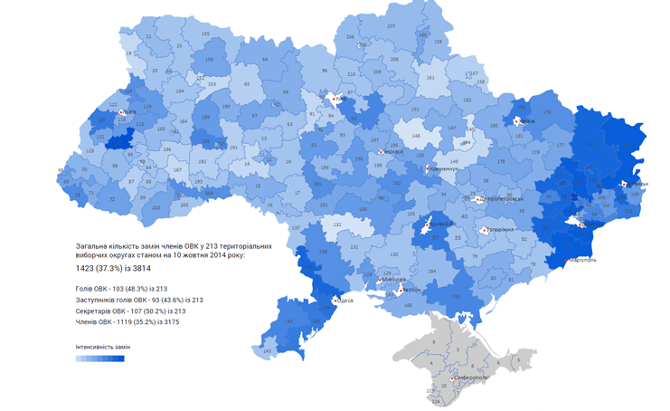
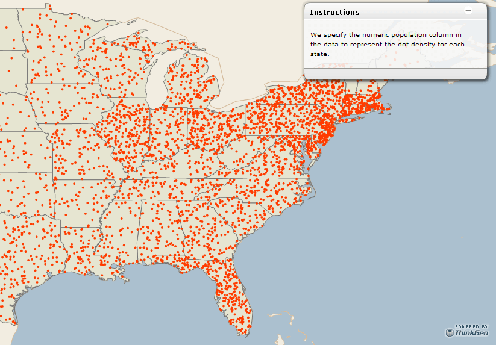
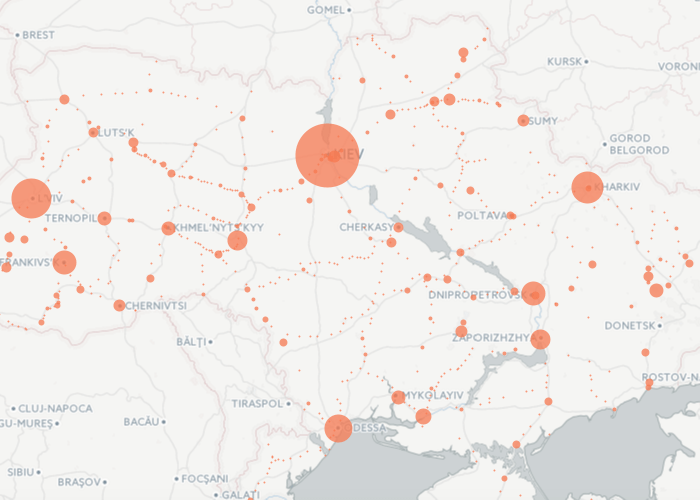
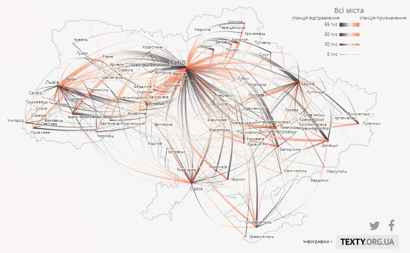
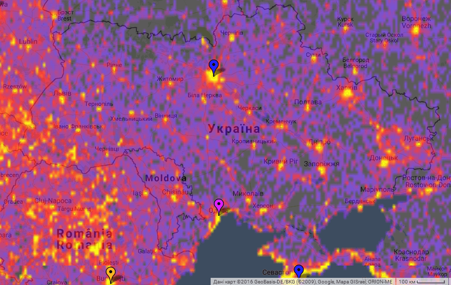
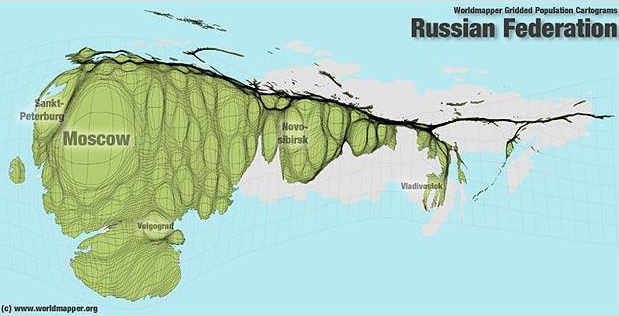
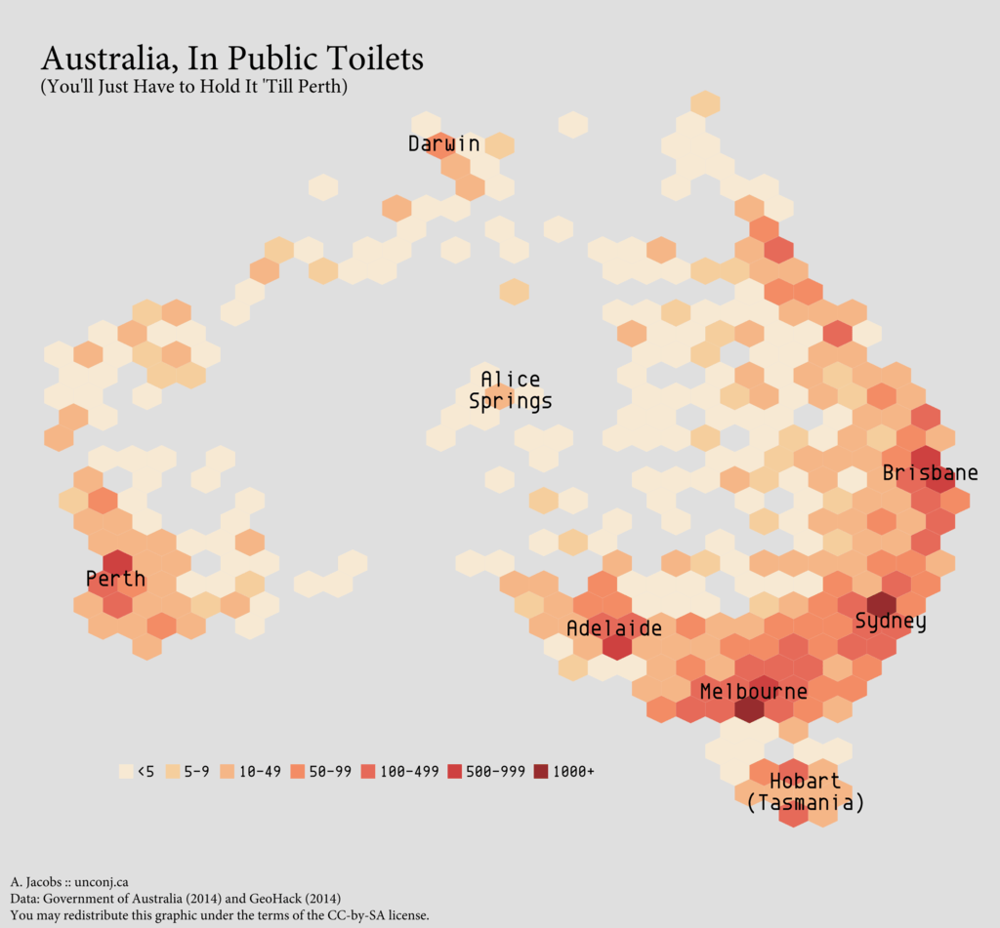

# 6. Мапи та геоінформація

*У розділі подано загальну інформацію про формати мап і засоби використання їх у візуалізації даних.*

За всього різноманіття візуалізуаційних технік, одна група стоїть осібно. Це мапи.

По-перше, мапа — чи не найстаріша техніка візуалізації.
Не випадково саме за допомогою метафори подоби і нетотожності мапи і місцевості
пояснюється відмінність уявлення про об'єкт від об'єкту і моделі від емпіричної реальності.
По-друге, як тільки ми стикаємося з розподілом чогось у просторі,
лише мапа унаочнює це адекватним чином, відповідаючи не лише на питання «де?»,
а і на «поруч із чим?», «далеко від чого?», тощо.

> #### щодо відкритості географічних даних
> Географічні дані здаються відкритими за своєю природою.
> Але до епохи супутникового відстежування всієї поверхні земної кулі
  і регулярної переробки цих даних у доступні публічно карти, географічні дані 
  певних місць і взагалі дані високої точності вважалися секретними.
  Деякі місця, пов'язані з воєнною і урядовою активністю, є секретними і тепер. 
  
Мапи у візуалізації даних використовуються по-різному,
зокрема кодовані кольором дані можуть використовуватися для розфарбовування мапи,
на мапі можуть розташовуватися діаграми,
сама мапа може трансформуватися відповідно до даних (картограма).
  
## Формати мап. Shapefile, KML, GeoJSON

Форматів файлів мап досить багато,
серед них бувають растрові, наприклад, GeoTIFF, і векторні, наприклад, KML.
Для використання у візуалізації даних придатніші векторні формати мап,
оскільки вони складаються з об'єктів, властивостями яких можна керувати,
наприклад, міняючи колір. 

Векторна мапа складається з точок, ліній і полігонів.
Лінії зображують лінійні об'єкти типу шляхів та річок, 
а полігони — контури морів і озер, островів і континентів, держав і адміністративних одиниць, тощо.
Об'єкти, з яких складаються мапи, організовано в  шари,
наприклад, географічні контури це один шар,
політико-адміністративний поділ — другий,
шляхи — третій, споруди — четвертий, і так далі.

На відміну від контурів у векторних малювалках,
полігони в одному шарі не мають перетинатися, інакше кажучи, у полігона, що зображує одну державу,
лінія кордону має точно співпадати з відповідною лінією сусідньої держави.

Найчастіше в роботі з геоданими використовується формат **Shapefile**.
Вперше запроваджений 1990 року в ArcView GIS, цей бінарний векторний формат
широко розповсюджений і підтриманий в багатьох програмах.
Власне, shapefile це не один файл, а чотири і більше файлів з однаковим ім'ям і різними розширеннями в одній теці:

- `.shp` — містить *власне набір об'єктів — точок, ліній або полігонів*;
- `.dbf` — атрибутивний файл; містить атрибути об'єктів, описаних в .shp файлі у форматі dBase IV;
- `.shx` — індексний файл; використовується для зв'язку між файлами .dbf і .shp;
- `.prj` — інформація щодо використаної проекції.

Точки об'єктів у shapefile мають чотири координати XYZM,
де X та Y задають пласку декартову систему координат і відповідають широті та довготі,
Z задає висоту точки, а M може використовуватися для користувацьких потреб.
Важливою неприємною особливістю shapefile є те, що в одному файлі можуть бути об'єкти лише одного типу —
або тільки полігони, або тільки лінії, або тільки точки.
Відповідно, мапу, де потрібні всі три типи об'єктів, описує мінімум три шейпфайли.

Прикладом іншого підходу до векторного формату картографічних даних можуть слугувати
текстові векторні формати.
Основою для їх побудови виступає вже знайома нам метамова XML.
Зокрема, Shapefile має різновид з подвійним розширенням `.shp.xml`,
в якому геодані записано відповідно до стандарту ISO 19115, але цей формат
використовується вужче, ніж оригінальний `.shp`.

Стандартизований XML-формат для геоданих, GML,
також не надто поширений порівняно зі спорідненим **KML.**
Цей формат розроблено 2001 року компанією Keyhole для продукта Keyhole Earh Viewer,
відомого тепер (після придбання Keyhole в 2004 році компанією Google) як Google Earth.
Цікавою властивістю KML є можливість записувати не лише
графічні примітиви у тривимірному (широта, довгота, висота) просторі,
а й задавати точку зору і властивості віртуальної камери,
що робить його дуже зручним для побудови тривимірних «реалістичних» картосхем.
KML підтримує створення тривимірних об'єктів як витяганням пласких примітивів за Z-координатою,
так і підставляти на місце об'єктів тривимірні моделі в широко підтриманому форматі COLLADA.
Ще одною важливою особливістю KML є можливість посилатися з одного KML-файла
на інші, в тому числі віддалені.
KML файли мають розширення `.kml` або, частіше, будучи стисненими ZIP 2.0, `.kmz`.

Ще більш орієнтований на роботу в мережі, головно на асинхронне оновлення за допомогою AJAX,
формат **GeoJSON**.
Він являє собою спосіб запису геоданих, використовуючи синтаксис вже знайомого нам JSON.
Поточний стандарт GeoJSON прийнято в серпні 2016 року, і з ним можна ознайомитися (англійською)
за адресою [tools.ietf.org/html/rfc7946](https://tools.ietf.org/html/rfc7946).
Розширення GeoJSON файлів — `.json` (адже це звичайний Джейсон) або специфічне `.geojson`.

Огляд багатьох інших форматів запису геоданих виходить за межі задач цього посібника.
Підсумовуючи сказане щодо геоформатів, 
якщо ми хочемо робити гарну тривимірну картосхему, нам треба шукати KML з інтегрованими моделями COLLADA,
в інших випадках годяться що Shapefile, що KML, що GML, що GeoJSON.

## Джерела картографічної інформації

Картографічну інформацію можна знайти і вільно завантажити, зокрема, з таких джерел:

OpenStreetMap
:    Краудсорсингова платформа побудови актуальної карти світу з багатьма інформаційними шарами.
     Використовує свій XML формат даних — `.osm`,
     також дозволяє завантажувати дані безпосередньо з серверів проекту.
     Дані регулярно оновлюються і поділені на сенсові шари.
:    [www.openstreetmap.org](http://www.openstreetmap.org)  — основний сайт, з якого можна експортувати обрану ділянку мапи.
:    Українська спільнота співавторів OpenStreetMap — [www.openstreetmap.org.ua/](http://www.openstreetmap.org.ua/)
     
Gadm.org
:    Глобальна геоінформаційна база **адміністративних кордонів**.
     Дані можна отримати у форматах shapefile і KML.
     Різним рівням поділу відповідають різні шари.
     Для України це державний кордон (0 в імені файла), кордони областей (1) і кордони районів (2).
     Населених пунктів на мапах Gadm.org немає.
:    [gadm.org/country](http://gadm.org/country) — меню вибору країни, [gadm.org/version2](http://gadm.org/version2) — вся база кордонів.

Diva-GIS
:    Колекція даних на сайті вільної геоінформаційної системи.
     Містить карти адміністративних кордонів, внутрішніх вод,
     залізниць, автошляхів, висот, типів поверхні, населення і назв.
     Різні дані в різних форматах, частина — векторні, мапи висот — растрові,
     назви — база даних `dbf` з рядками і координатами.
:    [www.diva-gis.org/gdata](http://www.diva-gis.org/gdata) — меню вибору країни і типу даних

Natural Earth Data
:    Вільні векторні і растрові карти різних масштабів і тематики,
     збирані волонтерами за допомоги Північноамериканського картографічного суспільства ([NACIS](http://nacis.org/))
     Багато різнопланової інформації в різних форматах.
:    [www.naturalearthdata.com/downloads/](http://www.naturalearthdata.com/downloads/)

Geofabrik.de
:    Споріднений з Open Street Map проект вільної карти світу.
     Надає доступ до опрацьованих геоданих, зібраних OSM.
     Дані опрацьовуються з кроком в часі, завдяки чому можна спостерігати історію змін.
:    [download.geofabrik.de/](http://download.geofabrik.de/)

Mapzen
:    Мапи окремих великих міст за даними Open Street Map з кроком в часі 1 тиждень.
:    [mapzen.com/data/metro-extracts/](https://mapzen.com/data/metro-extracts/)

## Інструменти для роботи з картографічною інформацією

QGIS
:    Вільна кросплатформна геоінформаційна система,
     в якій можна створювати і редагувати шейп-файли, поєднувати ці файли в шарах,
     отримуючи комбіновану мапу з потрібною інформацією.
     Цю мапу можна експортувати у векторний файл для подальшої обробки в Illustrator або Inkscape,
     або експортувати у інші формати — від простих картинок і до складних картографічних форматів.
     Для багатьох задач необхідне використання відповідних плагінів, які можна знаходити
     і завантажувати прямо з інтерфейсу програми.
:    > QGIS це зручна географічна інформаційна система (ГІС) з відкритим кодом, 
       що розповсюджується на умовах GNU General Public License.
       QGIS є проектом Open Source Geospatial Foundation (OSGeo).
       Вона працює на Linux, Unix, Mac OSX, Windows та Android,
       підтримує безліч растрових та векторних форматів,
       бази даних та має багаті можливості.
     > *[Розділ «Знайомство» на сайті програми](http://www.qgis.org/uk/site/about/index.html)*
:    Завантаження програми [www.qgis.org/uk/site/forusers/download.html](http://www.qgis.org/uk/site/forusers/download.html)

Carto DB
:    Веб-сервіс для побудови картографічних візуалізацій і хостингу веб-карт.
     Безплатний до певного розміру даних, для більш масштабного використання треба платити.
:    [carto.com](https://carto.com/)

Mapbox studio
:    Повноцінна онлайн геоінформаційна система, має всі засоби для створення і редагування шейп-файлів та хостингу мап.
     За трафіка до 50 000 заходів на місяць користування системою безплатне.
:    [mapbox.com/mapbox-studio](https://www.mapbox.com/mapbox-studio/)

Tilemill
:    Програма для створення стилів та фільтрів інформації для різних масштабів тайлів онлайн мап
     з використанням знайомих онлайн-розробникам засобів — каскадних стилів, у варіанті CartoCSS.
     Онлайн-версію закрито (продукт перекуплено *Mapbox Studio*), але є десктопні версії
     для Windows, MacOSX і Linux.
:    [mapbox.com/tilemill](https://www.mapbox.com/tilemill/)

Landsat Util
:    Набір утиліт командного рядка для пошуку, завантаження і обробки знімків
     з  супутника дистанційного зондування Землі Landsat 8.
     Можна шукати зображення за датою, територією, фільтрувати за хмарністю,
     і обробляти багатошарову сиру супутникову інформацію для отримання
     готового знімку потрібної території із потрібними властивостями.
:    [github.com/developmentseed/landsat-util](https://github.com/developmentseed/landsat-util)

## Види карт

Хороплетна (Choroplet) або фонова картограма
:    Найпоширеніший спосіб кодування інформації на картах. Інформацію кодують кольорами і відтінками полігонів.
:    

Точкова (Dotted)
:    Інформацію кодують розташуванням і щільністю точок на карті.
     Інколи використовуються кілька кольорів для кількох типів точок.
:    

Бульбашкова (Bubble)
:    Як точкова, але для кодування використовується діаметр точок-бульбашок.
:    

Потокова (Flow)
:    Відображає рух із одних точок в інші,
     у вигляді прямих (якщо візуалізовано лише інтенсивність руху)
     або дуг (якщо візуалізовано окремо прямий і зворотній рухи).
:    

Теплокарта (Heat)
:    Інформація кодується насиченістю кольору (але не по полігонах, а «розмиттям» точок промірів)
:    

Картограма (Cartogram)
:    Для кодування інформації використовується деформування полігонів відповідно до значення змінної.
     Ефективна для візуалізації дисбалансів розподілу чогось по території, часто нечитабельна без
     допоміжного неспотвореного контура.
:    

Hexbin
:    Інформацію кодовано насиченістю кольору, але на відміну від хороплетних
     (де розфарбовуються полігони) і (де формуються складні згладжені контури)
     розфарбовується сітка-стільник з шестикутників. Також може варіюватися заповненість шестикутників.
:    

## Корисні інструменти

Batch Geocoder
:    Веб-сервіс пошуку географічних координат за адресою.	
:    [findlatitudeandlongitude.com/batch-geocode](http://www.findlatitudeandlongitude.com/batch-geocode)

Color Brewer
:    Веб-інструмент добирання кольорів для розфарбовування мап.
:    [colorbrewer2.org](http://colorbrewer2.org)

Mapshaper
:    Веб-інструмент для редагування Shapefile, GeoJSON, TopoJSON.
     Може спрощувати форми, редагувати атрибути, обрізати тощо.
:    [mapshaper.org](http://www.mapshaper.org/)

