# 4. Основи статистики та аналізу даних {.ws #ch3}

*У розділі розглядаються різні способи аналізу даних,
описуються базові статистичні інструменти
та інструменти для стиснення інформації засобами статистики*

Метою аналізу даних є **знання** про об’єкт дослідження --- виявлення
корисної інформації, знайдення висновків, врешті, розумне (зважене)
прийняття рішень. Аналіз даних може мати багато аспектів та підходів,
реалізовуватися за допомогою різних інструментів --- в тому числі
математичних, статистичних, за допомогою різноманітних способів
візуалізації, але головне завдання його --- **стиснення інформації**.

Так, у прикладі з ціною та смаком черешень на базарі --- із попередніх
розділів --- кількість самих спостережень дуже невелика, і для прийняття
рішення (купівлі черешні) не потрібно застосовувати різні статистичні
інструменти.

Втім, працюючи з відкритими даними, часто можна мати справу
масивами даних, що містять сотні, тисячі, а то й сотні тисяч спостережень.
Неозброєним оком людина навряд чи зможе зробити з цих даних якісь коректні висновки.
Тому потрібно застосовувати різні засоби для узагальнення, стиснення інформації,
представленої в «сирих» або мікроданих.

**Статистика --- наука збору, представлення, аналізу і розумної інтерпретації даних.**

Статистика являє собою строгий науковий метод, що дозволяє зрозуміти дані, дійти до їх суті.
Наприклад, у дослідженні вимірюється вага 100 пацієнтів.
Це уже достатньо велика кількість спостережень,
і просто глянувши на дані неможливо отримати швидке інформативне уявлення.
Однак статистика може дати миттєву загальну картину даних ---
на основі доступної для сприйняття візуалізації або числового узагальнення ---
незалежно від кількості спостережень чи одиниць даних.
Окрім узагальнення даних, важливим завданням статистики
є формулювання логічних висновків та передбачення залежностей між змінними.

Статистичні методи можуть бути використані для отримання відповідей на
кшталт:

1.  Якого типу дані і в якій кількості потрібно зібрати?
2.  Як варто організувати та узагальнити дані?
3.  Як ми можемо проаналізувати дані та дійти висновків?
4.  Як ми можемо оцінити силу висновків та оцінити їхню непевність?

Перше питання ми дещо розглянули в першому розділі, коли говорили про збирання даних.
Про організацію та структурування даних ми говорили в другому розділі.
У цьому розділі йтиметься переважно про узагальнення та аналіз даних.

## Види шкал та змінних

Ми вже говорили про типи даних в першому розділі,
але для цілей статистичного аналізу варто дати означення основних типів змінних (та типів шкал) ---
від цього залежить, які математичні операції можна робити з різними змінними для статистичного аналізу.

Змінна --- будь-яка характеристика об’єкта, що вимірюється чи
досліджується. Змінна може набувати різних значень для різних об’єктів.
Виділяють такі типи шкал:

Номінальна.
:   Категорійна змінна, значення якої не можуть бути впорядковані --
    наприклад ім’я людини
    («Якби вибори Президента України відбулися у найближчу неділю, за кого б Ви проголосували?»)
    або стать.

:   Єдина операція, яку можна застосовувати до змінних з номінальною шкалою ---
    це перелік, підрахунок частоти появи того чи іншого значення в масиві.

Порядкова.
:   Змінна, значення якої за означенням впорядковані
    (наприклад «слабо», «помірно», «сильно»).
    Прикладом порядкової змінної в соціологічному опитування буде питання типу:
    «Наскільки ви довіряєте самому собі?» --- з варіантами відповіді
    «Зовсім не довіряю», «Скоріше не довіряю, ніж довіряю»,
    «Важко сказати довіряю чи ні», «Скоріше довіряю ніж не довіряю», «Цілком довіряю».
    Або ж значення в полі «Освіта»
    (неповна середня, середня, середня спеціальна, незакінчена вища, вища, вчений ступінь).

:   Значення такої змінної можна порівнювати на тотожність, на «більше-менше»,
    але при  цьому не можна сказати **наскільки** більше чи менше.

**Метричні шкали:**

Інтервальна.
:    Значення змінної впорядковані як в порядковій
     шкалі, але при цьому відмінності між значеннями є змістовними –--
     наприклад, температура за Цельсієм, часові інтервали, тощо.
     
:    Допустимі операції –-- додавання та віднімання, але не множення  чи ділення.

Шкали відношень
:    Шкала вимірювань  кількісної властивості,
     змінні мають всі властивості, що й інтервальні, але також мають
     «природню» нульову точку «відліку» --- наприклад вік, вага,
     температура за Кельвіном.

:    Додавання, віднімання, множення, ділення --- є змістовними операціями.

Також змінні розділяють на дискретні та неперервні.
Так, кількість дітей у якійсь родині, кількість автомобільних аварій на певній території,
або кількість людей, що прочитали цей текст за останній місяць ---
це результат простого підрахунку випадків настання певного явища,
і тому є значеннями дискретних змінних.
Дискретною є змінна, значеннями якої можуть бути лише цілі числа.

А неперервні змінні --- такі як довжина, вага, температура, вік ---
можуть бути виміряні достатньо точно, і не мають мінімальної неподільної одиниці виміру.
Вага може бути виміряна з точністю до грама, а може --- й до мікрограма,
а вік --- з точністю до днів, годин, хвилин, секунд.

У невеликих масивах даних ми можемо знайти
принаймні
мінімальне та максимальне значення, побачити, наскільки повторюються значення
або наскільки багато значень є близькими один до одного.
Для цього досить відсортувати масив даних в електронній таблиці за певною колонкою
(змінною) --- впорядкувати масив за певною ознакою.
Але коли масиви даних надто великі, потрібно застосовувати інші методи для стиснення
інформації, отримання розуміння про характеристики масиву.

## Описова статистика

Найпростішими способами статистичного аналізу є описові статистики, які,
як видно з назви, на найпростішому рівні кількісно описують або
підсумовують масив даних.

### Одновимірний розподіл

Одновимірний розподіл --- дозволяє підсумувати частоту, з якою різні
значення певної змінної спостерігаються в наборі даних.
Наприклад, ми маємо набір даних, у якому представлено 26 дітей віком від 1 до 6 років.
Тоді частотний розподіл змінної «вік» може виглядати у таблиці наступним
чином:

  --------- --- --- --- --- --- ---
  Вік       1   2   3   4   5   6
  Частота   5   3   7   5   4   2
  --------- --- --- --- --- --- ---

Звісно, коли у нас змінні інтервальні, і значень їх дуже багато,
доцільно розбити на певні інтервали, об’єднати значення змінних за
певними категоріями:

  -------------- ----- ----- -----
  Вікова група   1–2   3–4   5—6
  Частота        8     12    6
  -------------- ----- ----- -----

Можна також побачити частоту того чи іншого значення у вигляді частки чи
відсотка від усіх спостережень. У таблиці нижче представлено частотний
розподіл та відносний частотний розподіл.

  Оцінка студентів   Частота   Відносна частота
  ------------------ --------- ------------------
  0 – 25             2         0,13
  26 – 50            5         0.31
  51 – 75            4         0.25
  76 – 100           5         0.31
  Разом              16        1,00

Як видно з таблиці, підсумок відносної частоти в у кожній з категорій
дорівнює 1 --- або 100% --- оскільки включає в себе всі спостереження.

Одновимірний розподіл може бути реалізований щодо якісних та кількісних
змінних, дискретних та неперервних, для відкритих та закритих категорій
(так, «відкритою» категорією буде «люди старші 60 років», або «дохід
нижче 3000 грн»). Ми можемо класифікувати дані за кількісними
характеристиками --- такими як вікові групи, зарплата, рівень доходу,
тощо; можемо також класифікувати за якісними характеристиками --- такими
як стать, професія, національність, тощо.

:Приклад --- частотний розподіл кількісних дискретних даних з відкритою
категорією

  Рівень доходу, грн   Частота   Відносна частота
  -------------------- --------- ------------------
  0 – 5000             15        0,30
  5000 – 10000         25        0,50
  10000 –              10        0,20
  Разом                50        1,00

<!-- треба, щоби не злипалися таблички -->

:Приклад --- частотний розподіл даних номінальної шкали виміру

  Стать      Частота   Відносна частота
  ---------- --------- ------------------
  Чоловіки   20        0,40
  Жінки      30        0,60
  Разом      50        1,00

### Двовимірний розподіл або крос-табуляція

Ще одним способом узагальнення даних в таблиці є двовимиріний розподіл ---
«крос-табуляція». По суті, це таблиця, що представляє дані, зіставляючи
дві окремі характеристики (змінні) --- по колонкам і рядкам.
Так, в колонках --- різні значення (чи групи значень, категорії) однієї змінної,
а в рядках --- значення іншої змінної.

У попередньому розділі, де йшлося про структурування даних, ми
розглядали як приклад таблицю з даними Держстату --- як приклад погано
структурованих даних.

  Область            2012     2013     2014
  ------------------ -------- -------- --------
  Вінницька          35441    37323    39184
  Волинська          19546    20609    21971
  Дніпропетровська   95349    99995    109545
  Донецька           128767   135362   114135

Важливо розуміти, що з точки зору грамотного і охайного структурування
даних --- до початку аналізу --- в наборі даних (в таблиці) всі змінні мають
бути в колонках, всі спостереження в рядках, а на їх перетині --- значення
змінних для спостережень.

Але для аналізу даних, ми можемо порівнювати одні змінні з іншими,
робити крос-табуляцію, будувати двовимірні розподіли --- наприклад для
того, щоб на найпростішому рівні виявити залежності між змінними.

Візьмімо для прикладу два одновимірних розподіли наведених вище ---
за доходом і статтю.

  Стать              Дохід      Разом у рядках
  ------------------ ---------- ----------------
                     0 – 5000   5000 – 10000
  Чоловіки           7          9
  Жінки              8          16
  Разом у колонках   15         25

Будуючи таблицю розподілу для набору даних, що містить велику кількість
спостережень, варто дотримуватися таких основних правил:

-   Знайти найменше та найбільше значення змінної
-   Визначити «ширину» категорій, за якими будуть згруповані значення
    змінної
-   Включити всі можливі значення змінної

Визначаючись із шириною інтервалу, потрібно знайти компроміс ---
щоб інтервали були достатньо вузькими
(щоб всі або більшість спостережень не потрапили в один інтервал),
і при цьому достатньо широкими
(щоб не вийшло так, що буде в по одному спостереженню в інтервалі).
Також важливо, щоб інтервали були взаємно виключними.

## Міри центральної тенденції

У статистиці, такі показники розподілу як **середнє**, **мода** та
**медіана** --- називають мірами центральної тенденції.
Вони показують загальні характеристики розподілу даних за певною змінною,
дозволяють виявити одне значення
(або кілька значень --- якщо мода в розподілі не одна, але про це детальніше згодом),
що описує весь розподіл.
Можна також сказати, що середнє, мода та медіана --- це окремі значення що
представляють весь набір даних, типові для всіх значень у групі.

Міри центральної тенденції потрібні з наступних міркувань:

1.  Щоб отримати загальну картину розподілу. Ми не можемо запам’ятати
    кожен факт, що стосується сфери дослідження.

2.  Щоб отримати чітку картину щодо досліджуваної сфери для розуміння та
    отримання потрібних висновків.

3.  Щоб отримати чіткий опис групи в цілому та мати змогу порівнювати
    дві або більше груп у термінах типової «поведінки».

###Середнє (Mean)

Найвідомішою мірою центральної тенденції ---
і найбільш вживаною в повсякденному побуті ---
є середнє, або ж просте середнє, або ж арифметичне середнє (arithmetic mean) ---
просто середнє значення ряду даних.

Для його обчислення досить скласти разом всі значення в розподілі,
і поділити на кількість спостережень.
В Екселі чи Google Spreadsheets для цього є функція MEAN.
Є різні математичні способи підрахунки середнього,
але в усіх сучасних електронних таблицях
та спеціальних програмних пакетах для роботи з даними і статистикою
є ця функція, тож ми не будемо зупинятися
на математичних викладках.

Є певні загальні правила для використання середнього, зокрема:

1.  Середнє --- це «центр тяжіння» розподілу,
    і кожне значення дає внесок у визначення середнього значення,
    коли поширення значень є симетричними довкола центральної точки.

2.  Середнє значення більш стабільне, ніж медіана чи мода.
    Тому, коли потрібно знайти найбільш стабільну міру центральної тенденції,
    використовують середнє.

**Переваги середнього:**

1. Середнє визначене дуже жорстко, тому не виникає питань чи нерозуміння
щодо його значення та суті.

2. Це найбільш поширена міра центральної тенденції, оскільки її легко
зрозуміти.

3. Середнє легко підрахувати.

4. Враховує всі значення розподілу.

**Обмеження чи недоліки середнього:**

1. На значення середнього впливають екстремальні значення (відомий
іронічний жарт про «середню температуру по лікарні»).

2. Часом середнім є значення, що не присутнє в розподілі.

3. Часом результатом можуть бути абсурдні значення.
   Наприклад, маємо 41, 44, та 42 учнів у 5а, 5б та 5в класах якоїсь школи.
   Виходить, що середня кількість учнів у 5 класах школи -- 42,3(3).
   А так не буває.

###Медіана (Median)

Медіану можна визначити як точку на ряді розподілу
(впорядкований набір значень змінної для різних спостережень ---
наприклад від найменшого до найбільшого значення) ---
до цієї точки розташовано половина всіх значень,
і після цієї точки теж половина значень.
Тобто, медіана, це значення, що ділить впорядкований ряд навпіл.
Якщо кількість значень непарна,
то береться одне зі значень --- те, що стоїть у розподілі рівно по центру.

Коли значень парна кількість,
то беруть два центральні значення,
і знаходять їхнє середнє.

Для чого використовують медіану?

1.  Коли потрібно знайти точну середню точку, точку на «півдорозі» від
    найменшого значення до найбільшого.

2.  Коли екстремальні значення впливають на середнє --- медіана є
    найкращою мірою центральної тенденції.

3.  Медіану використовують коли потрібно, щоб певні значення впливали на
    центральну тенденцію, але все, що про них відомо --- що вони «нижче»
    або «вище» медіани

**Переваги медіани:**

1. Легко вирахувати та зрозуміти.

2. Для підрахунку медіани не потрібні всі значення в розподілі.

3. Екстремальні значення розподілу не впливають на медіану.

4. Її можна визначити і для «відкритих» категорій / класів інтервалів.

**Обмеження медіани:**

1. Вона не так жорстко визначена як середнє, оскільки її значення не так
вираховується, як знаходиться (серед значень в розподілі).

2. Не враховує всі спостереження (значення для всіх спостережень).

3. З медіаною потім не можна робити алгебраїчні перетворення так, як із
середнім.

4. Потребує впорядкування значень або класів інтервалів у висхідному чи
спадному порядку.

5. Часом медіаною може бути значення, не присутнє у самому розподілі.

### Мода (Mode)

Третя міра центральної тенденції --- це **мода** ---
значення, що найчастіше
зустрічається в розподілі. Як правило, вона представляє найбільш типове
значення. На моду ніколи не впливають екстремальні значення в розподілі,
а впливають – екстремальні частоти значень, наскільки часто те чи інше
значення змінної зустрічається в розподілі.

**Мода використовується:**

1.  Коли нам треба швидка і приблизна міра центральної тенденції.

2.  Коли потрібна міра центральної тенденції, що має бути
    типовим значенням.

**Переваги моди:**

1. Мода показує найбільш поширене значення в розподілі.

2. На моду не впливають екстремальні значення – так як на середнє.

3. Моду можна визначити для відкритих інтервалів / категорій.

4. Допомагає аналізувати якісні дані.

5. Моду можна виявити просто побудувавши графік розподілу чи стовпчасту
діаграму.

**Обмеження:**

1.  Не включає до визначення / розрахунку всі спостереження розподілу, а
    лише концентрацію частот.

2.  Подальші алгебраїчні перетворення неможливі – на відміну
    від середнього.

3.  Буває важко визначити моду у випадку багатомодального чи
    бімодального розподілу

Розподіл може мати більше двох популярних значень, але якщо має більше
ніж трьох мод, опис такого розподілу в термінах найбільш частих значень
може втрачати будь-який сенс.

[yourarticlelibrary.com/education/statistics/central-tendency-meaning-uses-and-measures/64944/](http://www.yourarticlelibrary.com/education/statistics/central-tendency-meaning-uses-and-measures/64944/)

> #### {-}
>
Як читач вже міг помітити, ми вже активно використовуємо графічне
відображення, візуалізацію даних – для їх аналізу.
>
> Ми можемо представити розподіл даних (особливо одновимірний розподіл)
різного типу графіками. Як правило, використовуються два виміри (дві
осі) у графіках для розподілів. На осі X розташовують значення змінних,
а на осі Y – частоту цих змінних – у абсолютних чи відносних значеннях.
>
>Нагадаємо собі, що аналіз даних, побудова певних висновків на основі
масивів даних – це, в першу чергу, стиснення інформації, її
узагальнення. Так, побудова простої стовпчастої діаграми – засобами
будь-якої електронної таблиці, наприклад, - дає нам можливість швидко і
просто – візуально – визначити моду або медіану. Детальніше візуалізацію
даних буде розглянуто у наступному розділі, але загалом, треба
пам’ятати, що візуалізація даних – не лише важливий елемент
представлення даних, наприклад, під час публікації результатів
дослідження, але й важливий елемент аналізу, що дозволяє швидко
знаходити особливості в масиві даних, робити певні висновки,
наштовхувати на ті чи інші шляхи подальшого аналізу.
>
>Власне, пояснення наступного важливого поняття у статистиці –
нормального розподілу – навряд чи можливе без візуалізації, без графіку
т.зв. «кривої Ґауса».

##Нормальний розподіл (Normal distribution)

Розподіл у якому всі три міри центральної тенденції збігаються – тобто
середнє дорівнює медіані і дорівнює моді, називається нормальним (є ще
інші характеристики нормального розподілу, але про них згодом – а ці є
основними).

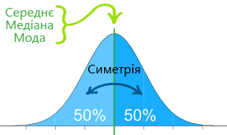

Його також називають розподілом Ґауса або «дзвоноподібним» (bell-shaped curve) –
адже графік нормального розподілу подібний на форму дзвона у профіль.
Інколи кажуть, що нормальний розподіл відіграє у статистиці таку ж роль,
як Ньютонова механіка – у фізиці.

<!--  -->

Нормальний розподіл – найбільш відомий з усіх розподілів, і його
застосовують для аналізу напевно найбільше за інші. Оскільки нормальний
розподіл так гарно описує багато природних явищ, то він став де-факто
стандартом відліку для багатьох ймовірнісних / статистичних задач.

Для прикладу, візьмемо розподіл зросту жінок певного віку в певній
країні. Найбільш популярними будуть значення, що відповідають
«середньому зросту», а екстремальних значень – дуже низький зріст і дуже
високий – буде дуже мало.

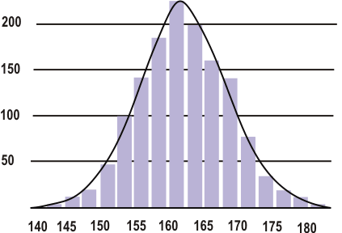

Чому модель нормального розподілу є корисною?

-   Багато речей у світі є «нормально розподіленими», або ж дуже
    близькими до нормального розподілу. Окрім зросту, про який ми
    говорили, похибки вимірювання також мають нормальний розподіл.

-   З нормальним розподілом легко працювати математичними засобами. У
    багатьох практичних випадках, методи, розроблені з використанням
    теорії нормального розподілу, працюють досить добре, якщо розподіл і
    не є нормальним.

-   Застосування нормального розподілу дозволяє виявляти різні аномалії
    і в суспільному житті – наприклад фальсифікації на виборах
    ([news.liga.net/articles/politics/767097-gauss_protiv_falsifikatsiy_anomalii_na_vyborakh_2012.htm](http://news.liga.net/articles/politics/767097-gauss_protiv_falsifikatsiy_anomalii_na_vyborakh_2012.htm) )

У нормальному розподілі, більша частина значень даних має тенденцію до
групування, «кластеризації» довкола середнього значення. Чим далі
значення від середнього – тим менша ймовірність його появи. Звичайно,
розподіли в реальному житті абсолютно точно не відповідають нормальному.
Але ви здивуєтеся, як багато явищ, у розподілі за своїми параметрами
надзвичайно наближаються до нормального розподілу. Центральна гранична
теорема теорії ймовірності свідчить про те, що сукупність незалежних,
приблизно однаково розподілених величин має нормальний розподіл.

Значення у розподілі також ділять по осі X за **стандартними
відхиленнями** (standard deviations). Стандартне відхилення
використовується як індикатор того, наскільки «розкиданими» відносно
середнього є значення певної змінної в наборі даних, і вимірюється в тих
же одиницях виміру, що й змінна, розподіл. Важливо знати, що в
нормальному розподілі 68% значень знаходяться в межах одного
стандартного відхилення від середнього (тобто +/- 1 стандартне
відхилення)

 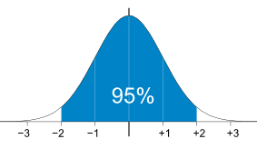  

При цьому, 95% значень – в межах двох стандартних відхилень від
середнього, а 99.7% - в межах трьох стандартних відхилень.

### Дисперсія і стандартне відхилення

**Що ж таке це стандартне відхилення**, і як його рахують?
Формула підрахунку насправді дуже проста – це корінь квадратний від **дисперсії** (variance).

Дисперсія є мірою відхилення значень випадкової величини від центру
розподілу (середнього). Більші значення дисперсії свідчать про більші
відхилення значень випадкової величини від центру розподілу. Дисперсія
підраховується як середнє квадратів різниці значень розподілу і
середнього розподілу. Тобто, спочатку виявляємо середнє розподілу, потім
від кожного значення віднімаємо значення середнього, підносимо його у
квадратний ступінь, для всіх цих квадратів вираховуємо середнє. Це й
буде дисперсія. Для того, щоб отримати стандартне відхилення, що
вимірюється в тих же одиницях, що й значення змінної, яку ми
спостерігаємо, береться квадратний корінь з дисперсії.

Міри розкиду – такі як дисперсія і стандартне відхилення – дають нам
розуміння, наскільки добре, наприклад, середнє представляє весь набір
даних. Якщо розкид значень у розподілі великий, то середнє не є таким
репрезентативним, ніж якщо розкид даних малий. Тобто, великий розкид
даних означає, що, ймовірно, є великі відмінності між значеннями.

## Бімодальні розподіли

Важливо також мати на увазі, що окрім нормальних розподілів, виміряні
суспільні явища можуть утворювати й інші розподіли – наприклад
бімодальні, тобто у яких є не одна мода («найпопулярніше» значення), а
дві (або й більше – хоча вважають, більше трьох мод у розподілі не мають
сенсу для аналізу). Тобто, два піки у бімодальному розподілі також
представляють два локальних максимуми.

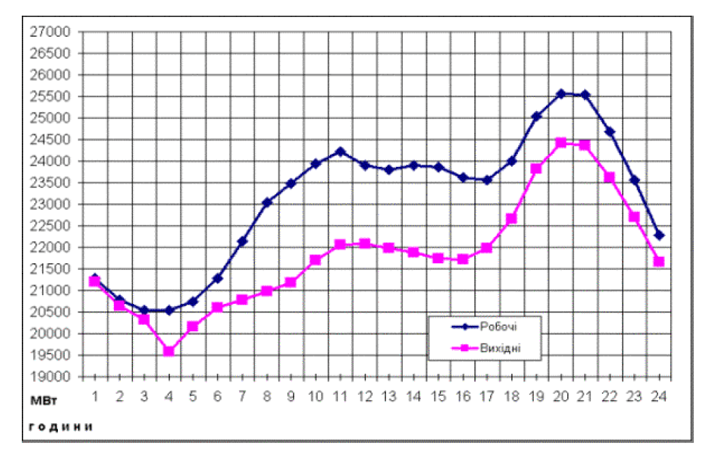

Бімодальність розподілу дає важливу інформацію про природу змінної, що
аналізується. Наприклад, якщо змінна являє собою рівень ставлення людей
до чогось, то бімодальний розподіл може означати протилежність думок.
Також бімодальність може показати, що вибірка не є однорідною, і те, що
ми спостерігаємо – спричинене двома або більше накладеними розподілами.
Так, наприклад, розподіл людей певного віку за вагою буде бімодальним,
якщо не виділити в окремі групи чоловіків та жінок.

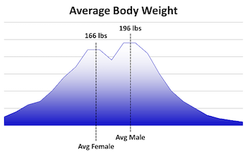

Інколи бімодальний розподіл може означати, що обрані інструменти не
підходять для вимірювання явища (наприклад «проблеми розмітки» у
природничих науках, «зміщені відповіді» у суспільних).

## Квартилі

Квартилі ділять розподіл даних на чотири рівні частини. Значення, які
ділять ряд розподілу, називаються першим (Q1), другим (Q2) і третім
квартилям (Q3). Значення другого квартиля відповідає значенню медіани –
оскільки рівно 50% значень знаходяться до другого квартиля і 50% значень
– після другого квартиля. Перший квартиль – це значення, що знаходиться
посередині між найменшим значенням і другим квартилем.

Квартилі – це корисний інструмент виміру розкиду, оскільки вони набагато
менше залежні від екстремальних значень чи перекосу в наборі даних, аніж
середнє та стандартне відхилення. Тому інформацію про квартилі часто
подають разом із медіаною (як міри розкиду та центральної тенденції) – у
випадку роботи з масивами даних, де є суттєві перекоси або екстремальні
значення. Часто квартилі подають у вигляді міжквартильного розмаху – як
різницю між третім і першим квартилями.

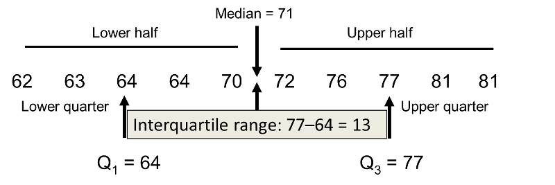

## Підсумок з п’яти значень

Підсумок з п’яти значень – це вид описової статистики, що надає
інформацію про набір спостережень, і, як видно із самої назви –
складається із п’яти важливих показників:

1.  Мінімальне значення в спостереженні
2.  Перший (або нижній) квартиль
3.  Медіана (серединне значення)
4.  Третій (або верхній) квартиль
5.  Максимальне значення

Ці п’ять показників дають досить вичерпний підсумок розподілу
спостережень. Перевага наявності цих п’яти показників, зокрема, у тому,
що не потрібно вирішувати, яка ж підсумкова статистика буде найбільш
прийнятною для аналізу розподілу. Так, п’ять показників дають інформацію
про центральну тенденцію (медіана), розмах (квартилі) і діапазон
(мінімальне та максимальне значення).

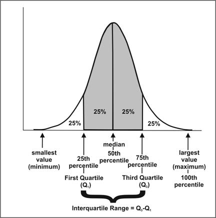

**Деякі варіанти візуалізації «підсумку п’яти значень»**

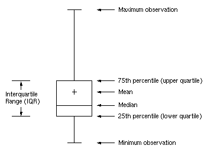 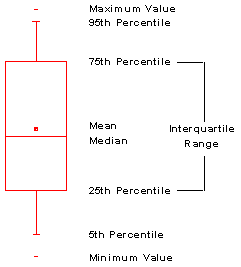

## Порівняння змінних і кореляція

Найбільш наглядний приклад показати зв’язок між двома кількісними
змінними – це діаграма розсіювання. На відміну від гістограм, які ми
розглядали раніше – під час аналізу одномірних розподілів, на осі y
показують не частоту того чи іншого значення змінної по осі x, а
значення іншої змінної. Крапка на діаграмі означає одночасно значення
двох змінних для одного спостереження («рядок» в таблиці даних).

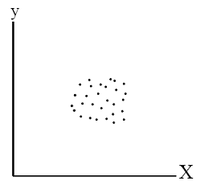

У кореляції є дві властивості – сила і напрям. Сила кореляції
визначається числовим значенням, а напрям – тим, чи кореляція позитивна
чи негативна.

-   Позитивна кореляція: обидві змінні міняються у тому ж напрямі.
    Тобто, якщо одна змінна зростає, друга зростає теж. Якщо одна
    спадає, то друга спадає так само.

    -   Наприклад, рівень освіти – скільки років людина навчалася (в
        нормальних країнах) та річний заробіток корелюють між
        собою позитивно.

-   **Негативна кореляція**: змінні рухаються у протилежних напрямках.
    По мірі того, як одна змінна спадає, інша росте, і навпаки.

    -   Наприклад – кількість годин, проведених людиною уві сні та
        кількість годин неспання – корелюють негативно (що очевидно –
        чим більше спиш – тим менше часу лишається на яві, і навпаки).

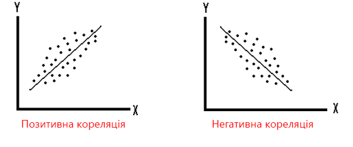

Коефіцієнт кореляції показує ступінь, до якого дві змінні пов’язані
(наскільки спільно чи подібно змінюються їх значення для різних
спостережень) – тобто якої сили між ними може бути зв’язок. Значення
коефіцієнта кореляції може бути від -1.0 до 1.0. Якщо вирахувана
кореляція більша за 1 або менша за -1 – значить десь у підрахунках
сталася помилка, адже 1 – означає абсолютну пряму (позитивну) кореляцію,
а -1 – абсолютну зворотню (негативну) кореляцію.

Як підраховується коефіцієнт кореляції? Дорівнює сумі добутків
відхилень, поділеній на добуток їх стандартних відхилень

Що означає, коли ми кажемо, що між двома змінними нема кореляції? Це
означає, що між двома змінними немає прямого зв’язку. Наприклад, немає
прямої кореляції між розміром взуття та зарплатою. Тобто, великі
значення розміру взуття мають такі ж шанси зустрітися серед людей з
високою зарплатою, як із низькою.

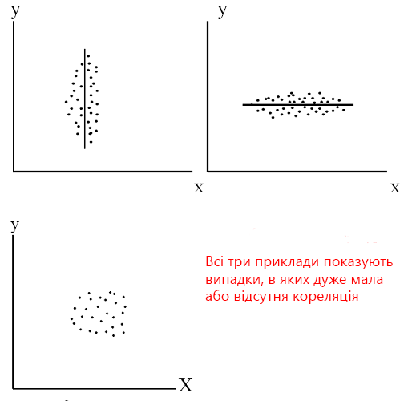

**Кореляція і причинно-наслідковий зв’язок**. Навіть якщо дві змінні
виглядають пов’язаними між собою, це не значить, що одна спричинила
іншу. Класичний приклад – це кореляція між ростом злочинності та
споживанням морозива протягом літніх місяців у США. Дві змінні є
пов’язані між собою, але жодне явище не є причиною іншого. Насправді,
обидва явища спричинені підвищенням температури повітря, а не одне
одним.

Важливо також пам’ятати, що кореляція – це міра лінійного зв’язку. При
цьому, кореляція не говорить нам, яка змінна впливає на яку – кореляція
лише показує наявність зв’язку, але впливу. Вимірюючи кореляцію, не
можна сказати – це А впливає на Б, чи Б впливає на А.

Діаграма розсіяння для двох змінних може виглядати, наприклад, так:

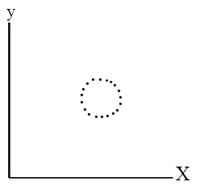

Для цих двох змінних кореляція буде дорівнювати нулю. Але це ще
не означає, що зв’язку між змінними немає ---
просто він може бути не лінійним.

## Регресія

Нагадаємо, що значення змінної, за означенням, може варіюватися,
мінятися від одного спостереження до іншого – наприклад, для різних
індивідів з різними характеристиками, або для різних проміжків часу. При
роботі із статистичними моделями, у яких деякі змінні використовуються
для того, щоб передбачити інші, дослідники намагаються виявити, що різні
змінні не змінюються **незалежно** (у статистичному сенсі), а що вони
мають тенденцію змінюватися разом.

Для цього виділяють **залежну** та **незалежну** змінну – тобто робиться
припущення, що залежна змінна змінюється в залежності від значень
незалежної змінної (наприклад, як міняється рівень споживання природного
газу домогосподарствами – в залежності від температури повітря в
Україні).

Регресійний аналіз допомагає зрозуміти, як типове значення залежної
змінної змінюється, коли змінюється незалежна змінна (у той час як інші
незалежні змінні зафіксовано). Регресія не тільки дозволяє побачити, як
одна змінна впливає на іншу, але й робити передбачення (наприклад, за
межами даних спостережень).

Цей метод вперше було використано для вивчення зв’язку між зростом
батьків і синів. Ці дві змінних, звісно, були пов’язаними між собою, але
кореляція була меншою за 1,0. Так, високий батько міг мати синів, нижчих
за нього, а низькорослий батько – вищих за нього синів. Висота синів
«регресувала» («рухалася назад») до середнього значення. Тепер термін
«регресія» використовується для різного виду підбору формул для опису
залежності змінних.

Лінія регресії (а ми розглядаємо зараз просту лінійну регресію) – це
пряма лінія, що намагається пояснити і передбачити залежності між двома
явищами, також відома як лінія тренду. Проста лінійна регресія – це
передбачення, коли одна змінна (y) залежить від іншої змінної (x), на
основі рівняння регресії (функції) для певного набору даних.

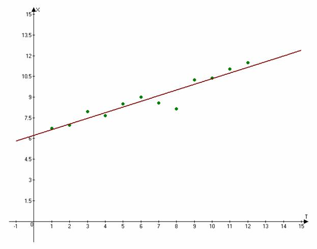

Чому ми припускаємо, що зв’язок між змінними є лінійним?

1.  Тому що лінійні зв’язки є найпростішими не тривіальними зв’язками,
    які можна уявити (і, відповідно, з ними найпростіше працювати)

2.  Тому що «реальні» зв’язки між змінними часто є принаймні
    **приблизно** лінійними для розподілу значень, що нас цікавить. 

3.  Навіть якщо зв’язки такими не є (не є лінійними), часто ми можемо
    **трансформувати** змінні таким чином, щоб зробити зв’язки лінійними

Це сильне припущення, і першим кроком в побудові регресійної моделі
варто подивитися на діаграму розсіяння змінних, щоб зрозуміти, чи має
сенс робити регресійний аналіз взагалі. Після підгонки моделі, варто
дослідити графіки помилок (plots of the errors), щоб побачити, чи є
непояснені нелінійні патерни. Це особливо важливо, якщо метою є зробити
припущення чи передбачення для сценаріїв за межами наявних історичних
даних (коли відмінності від чіткої лінійної моделі ймовірно матимуть
найбільший ефект).

Результатом регресійного аналізу має бути побудова рівняння (функції
залежності – залежної змінної від незалежної змінної) – наприклад

$$ y = 15 + 3x $$

MS Excel має можливості для розрахунку коефіцієнту регресії. Для цього
потрібно доінсталювати «Пакет аналізу» в надбудовах (як це зробити:
[goo.gl/Josoz3](http://goo.gl/Josoz3)

Отже, у регресії дві функції – передбачення та пояснення факторів.
Передбачення дає нам уявлення, як буде поводити себе залежна змінна,
якщо незалежна змінна буде приймати певні значення; тобто, маючи x,
можна спрогнозувати y (адже нам відоме рівняння регресії на основі
масиву спостережень). Пояснення факторів – це можливість зрозуміти
**наскільки**, y залежить від x, який вклад робить незалежна змінна в
залежну. Але, важливо пам’ятати, що в даному випадку ми говоримо лише
про лінійний зв’язок.

<!--  [*https://coursera.org/course/stat1*]: https://coursera.org/course/stat1 -->
