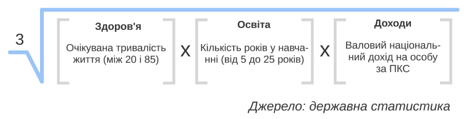
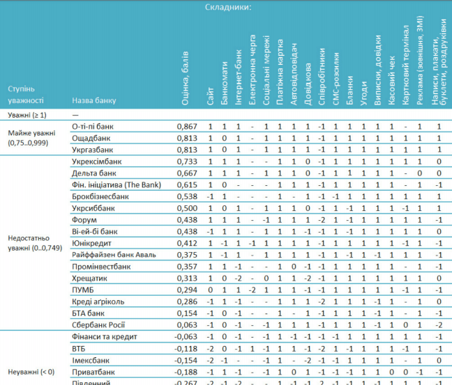
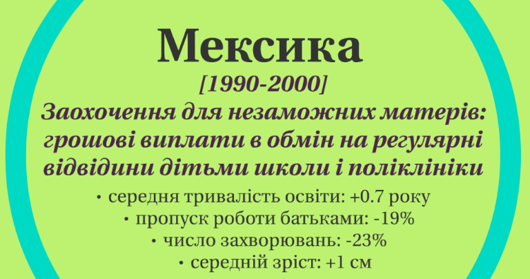
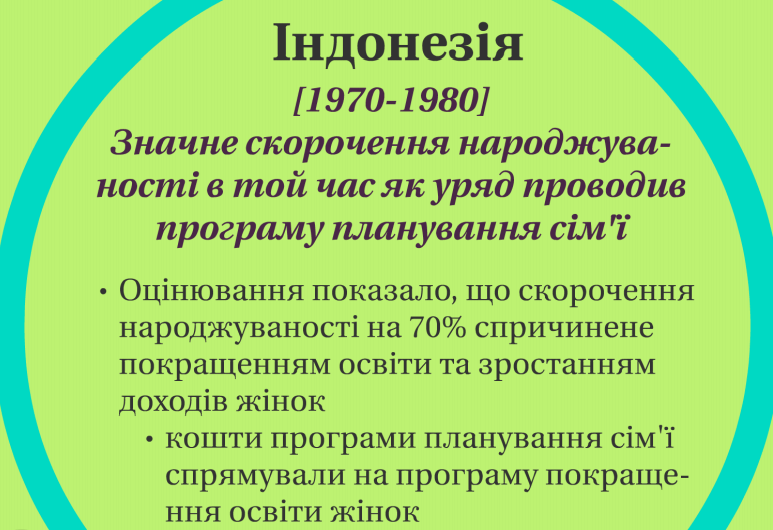
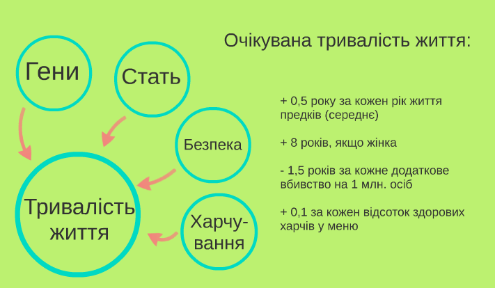
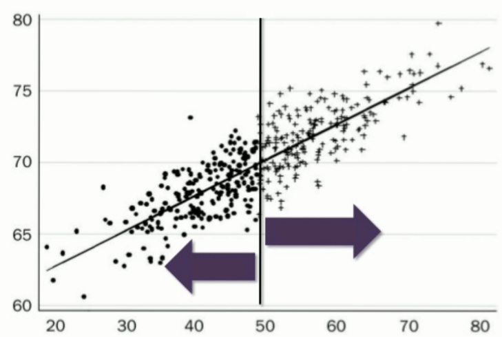
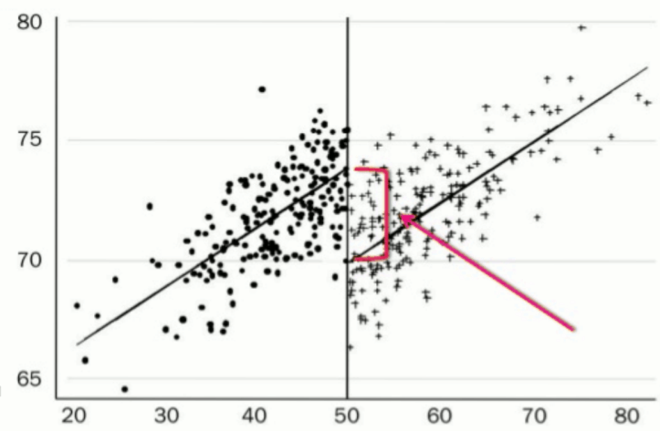
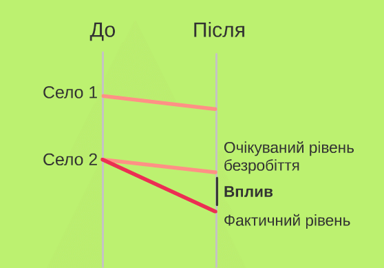
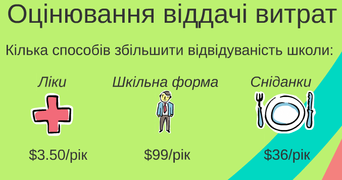

# 7. Приклади застосування даних {.ws #ch5}

*У розділі читач може ознайомитися із прикладами використання різних
систем збору і аналізу даних у практичних цілях --- зокрема з індексами та
методами аналізу успішності суспільних програм (державних чи
недержавних)*

**Індекси як метод аналізу та стиснення даних **
------------------------------------------------

Часто явище, яке ми аналізуємо, буває надто складним, щоб стисло
описати, включати в себе багато індикаторів, які можуть мати різні шкали
вимірювання, вимірюватися в інших одиницях. Звісно, ще важче донести
інформацію про ці явища широкому загалу, зацікавленій громадськості – на
кажучи вже про експертів. І тут до нас на допомогу приходить такий
винахід людства як індекси.

В повсякденному житті, із засобів масової інформації, або в силу
професійної діяльності ми регулярно стикаємося з різними індексами, які
дають уявлення про країни, регіони, компанії (чи будь-які явища
насправді). Прикладами таких індексів можуть бути:

-   [Індекс маси тіла]

-   [Індекс людського розвитку]

-   [Ґуґл пейджренк]

-   [Індекс економічної свободи]

-   [Легкість ведення бізнесу (*Ease of Doing Business Index*)]

-   [Індекс наукового цитування]

-   [Індекс БіґМака]

-   [Індекс споживчих цін]

-   [Індекс Доу Джонса]

-   Та багато інших..

Так, журналістам корисно розуміти значення індексів, як вони будуються,
що означають, громадські ж активісти можуть привертати суспільну увагу
до тих чи інших проблем через створення власних індексів. Адже індекси
дозволяють просто узагальнити складні явища чи несумісні величини
(виміряні в різних шкалах чи одиницях виміру), завжди є непоганим
новинним приводом, а також орієнтиром для дій.

Варто пам’ятати: показник, на який звертають увагу, завжди покращується.

Тож розглянемо кілька прикладів відомих індексів – як їх підраховують і
з чого вони побудовані.

### **Індекс людського розвитку**

- (англ. Human Development Index, HDI) — інтегральний показник, що
розраховується щорічно для міждержавного порівняння і вимірювання рівня
життя, грамотності, освіченості і довголіття і публікується в рамках
Програми розвитку ООН (був розроблений 1990 року).

Так, індекс цей відносно простий, базується на державній статистиці, і є
середнім геометричним показників здоров’я (тривалості життя), освіти та
доходів (корінь кубічний із добутку індикаторів із цих трьох сфер).
Країни в підсумку шикують за значенням індексу і за місцем відносно
інших: але кількість країн-учасниць щороку різна.

Важливо звертати увагу, що саме рахують і як це називають, щоб розуміти
обмеження того чи іншого індексу. Часто наявні дані дозволяють поміряти
щось схоже, але не зовсім те.

### **Легкість ведення бізнесу**

Індекс, який підраховує і публікує Світовий Банк для порівняння легкості
підприємницької діяльності між різними країнами світу. В основі його
лежить опитування – опитують близько 9000 фахівців в усьому світі,
узагальнюють дані щодо наступних 9 сфер: відкриття бізнесу, дозволи на
будівництво, реєстрація майна, отримання кредиту, захист прав
інвесторів, сплата податків, регуляції щодо міжнародної торгівлі,
забезпечення контрактів, закриття підприємства. Головні критерії, які
вивчають для побудови цього індексу – кількість, тривалість і вартість
процедур.

### Індекс БіґМака

Індекс БігМака підраховує журнал Economist, і ідея його дуже проста –
порівняння ціни на БігМак в США та інших країнах, що, в свою чергу може
свідчити про переоцінення чи недооцінення валюти тої чи іншої країни.
Ідея індексу має сенс, оскільки сендвіч БігМак має дуже стандартизовану
рецептуру, по суті це ідентичний продукт для всіх країн, де є
МакДональдз. Індекс багато критикують - тим не менше, дослідження
показують: хоча дані ІБМ системно викривлені, але, якщо це викривлення
врахувати - все працює (і при цьому БігМак коштує 10 доларів). Інколи
так буває, що не так важливо чи індекс бездоганний, головне що він
кращий з того, що є.

### Індекс держави-няньки

Призначення «Індексу держави-няньки» ([nannystateindex.org](http://nannystateindex.org/))
--- порівняння країн ЄС за можливістю вільно пити,
курити й споживати нездорову їжу. В індексі враховуються наступні
показники:

-   Спиртне: податки, реклама, державна монополія, обмеження часу
    продажу, рекламних акцій, водити машину;

-   Їжа: особливі податки, обмеження реклами, продаж в автоматах,
    обмеження використання складників, продаж енергетичних напоїв;

-   Сигарети: податки, реклама, написи на пачках, обмеження місць для
    куріння, заборона нюхати тютюн.

### Приклад власного індексу – зручність банків для україномовних киян

Євген Шульга зіткнувся з проблемою, що багато київських банків
не ставляться адекватно до україномовних клієнтів,
і послуговуються переважно російською мовою,
або використовують українську мову як другорядну,
тож він вирішив провести дослідження
і вивести індекс поваги до україномовних споживачів.

Для аналізу використовувалися 20 найбільших банків за рейтингом НБУ.
Було виділено 17 ознак («точок дотику» з клієнтом):
сайт (наявність української версії, або встановлення її як основної);
мова, якою «спілкуються» банкомати;
інтернет-банк; електронна черга; соціальні платежі;
платіжна картка; автовідповідач; довідкова служба;
співробітники (якою мовою спілкуються, чи переходять на українську мову);
смс-розсилки; бланки; угоди; виписки та довідки; касовий чек;
картковий термінал; реклама; написи, плакати, буклети (у відділеннях банку).

Для всіх ознак була застосована одна шкала – від «-2» (зовсім погано з
точки зору зручності українця) до «1» (без перешкод). Підсумковий індекс
розраховувався як середнє значення – сума всіх оцінок, які отримав банк,
ділилася на число оцінок (при цьому відсутні послуги не враховувалися).

Таким чином, вийшли досить зважені і порівнювані показники для кожного
банку. Збір даних проводився на громадських засадах, з координацією
волонтерів через фейсбук протягом одного місяця. Для цього відвідувалися
сайти, відділення, тестувалися банкомати, здійснювалися дзвінки у
довідкову, спілкування з клієнтами.

Так, індекс дозволив визначити найкращі і найгірші банки з точки зору
використання української мови, визначити найбільш проблемні послуги.
Також цей індекс дає можливість порівняти оцінки в часі, підбити
підсумки і дати загальну картину по галузі. Методологію можна
застосувати до і оцінки інших галузей – і, відповідно, порівнювати
індекси для банків з індексами для інших галузей.

Після закінчення збору даних та обрахування індексів було надіслано
листи до керівництва банків з інформацією про результати дослідження
(керівництво обгрунтовано поінформоване про проблему, і тепер принаймні
усвідомлює її наявність), опубліковано матеріали у ЗМІ (наприклад:
[gurt.org.ua/interviews/18903](http://www.gurt.org.ua/interviews/18903/)).
Також чітка розроблена
методика дозволяє будь-кому продовжити роботу.

### Як можна побудувати власний індекс?

Для створення власного індексу можна, наприклад, використовувати
державну статистику. Можна також опитувати експертів – при цьому
відповіді їхні можна відображати з метою подальшого формування індексу у
відсотках, а можна в балах (які можна потім, наприклад підсумовувати чи
знаходити середнє – як було у випадку з індексом україномовності
банків). Можна провести власні виміри, а можна використовувати й інші
індекси – як джерело даних для побудови нового.

При цьому важливо пам’ятати, що показники доведеться нормалізувати,
особливо коли індекс об’єднуватиме різні показники, змінні з різними
типами шкал чи одиницями виміру. Для нормалізації можна використовувати:

-   Відсотки

-   Бали на спільній шкалі

-   Спільний знаменник

-   Середнє зважене

-   Корінь n ступеня з n множників

-   Середньоквадратичні відхилення

Приклад створення власного індексу (відео): 
[youtube.com/embed/V9BM0BhwezU](https://www.youtube.com/embed/V9BM0BhwezU)

Кілька важливих зауваг: журналістам, які публікують
результати досліджень, виражені в індексах, рейтинги чого-небудь із
застосуванням індексів, важливо розуміти значення цих індексів, за якою
методикою вони були побудовані, які дані включають в себе. Відтак
важливо також розуміти можливі прогалини в розрахунках і зборі даних.

Громадські ж активісти, які працюють з певною сферою і прагнуть певних
змін, мають обгрунтовано інформувати свої цільові аудиторії, тих, хто
приймає рішення. Створення власних індексів часом можуть дуже допомогти
– адже вони не лише добре привертають увагу (ЗМІ, громадськості,
урядовців чи бізнесу), а часом дійсно допомагають краще зрозуміти
природу явищ.

## Аналіз впливу державних та недержавних програм

Між отриманням даних і їх поширенням є певна практична складова. Як ми
вже казали, дані збирають, аналізують і презентують з певною метою, для
прийняття рішень. Одною із сфер застосування систем збору, аналізу, і,
звісно, візуалізації даних - це аналіз того, наскільки ефективними є ті
чи інші державні (або недержавні) програми, спрямовані на вирішення
певної суспільної проблеми (наприклад, покращення рівня здоров'я,
освіти, зайнятості, тощо). Програми ці складаються, як правило, із
комплексів заходів, що часто передбачають витрачання немалих коштів з
бюджетів. Як можна нібито відірвану від життя статистику застосувати з
реальною користю, що можна заощадити, або максимально ефективно
використати гроші платників податків - саме це ми розглянемо на прикладі
аналізу і оцінки ефективності програм.

Людські ресурси обмежені. Якщо ми робимо щось одне тут, то ми
відмовляємося від чогось іншого там. Можна захопитися якоюсь теорією,
яка, здавалося б, працює бездоганно, яка прекрасно і логічно пов'язує
одне з іншим, і на виході ти очікуєш якусь суспільну зміну. А виходить
не те, або не тою мірою. Оцінювання дозволяє знаходити відповіді на
питання - чому ті чи інші заходи не працюють, або де саме не працюють,
або не дають очікуваного ефекту (вплив недостатній, ніж очікувалося).

Деякі програми можна десятиліттями впроваджувати, і без якогось
реального ефекту. Тому оцінка державних програм за допомогою наукових,
статистичних методів, на основі грамотно зібраних і оброблених даних -
тобто даних високої якості і достовірності - надзвичайно важлива.

Так, останнім часом в США почали шукати докази ефективності державних
програм. Адміністрація Обами запровадила різні методи досліджень, щоб
подивитися чи працює та чи інша програма взагалі, наскільки ефективно
(щоб не виявилося, що програма працює на 1% умовно, а коштує мільярд
доларів). Насправді не так суттєво, державна програма чи недержавна -
принципові методи, статистичні інструменти однакові.

Можна підсумувати, навіщо потрібне оцінювання стосовно державних чи
недержавних програм:

-   Щоб знати, чи заходи досягають поставленої мети

-   Для підзвітності платникам податків (і жертводавцям)

-   Щоб зрозуміти, що працює, а що ні (і чому)

-   Порівняти, як програма діє за різних умов чи на різні групи

-   Встановлення причинно-наслідкових зв’язків

Що може являти собою ефективна державна програма?

Так, в Мексиці з 1990 по 2000 рік тривала програма для незаможних
матерів, що передбачала грошові виплати в обмін на регулярні відвідини
дітьми школи і поліклініки. Як виявилося, за підсумками програми середня
тривалість освіти виросла на 0.7 років, рівень пропусків батьками роботи
знизився на 19%, число захворювань упало на 23%, а середній зріст дітей
збільшився на 1 см.

В Індонезії в 1970-1980 рр. була інша ситуація – у зв’язку з
перенаселенням, необхідно було стимулювати скорочення народжуваності.
Уряд прийняв неординарне, здавалося б, рішення: кошти програми
планування сім’ї спрямували на програму покращення освіти жінок.
Оцінювання показало, що скорочення народжуваності на 70% було спричинене
покращенням освіти та зростанням доходів жінок.

У читача на цьому місці може виникнути закономірне питання – це все
добре, але як вони це все визначили чи виміряли?

### Порівняльна група

Методів оцінки багато, і вони можуть використовувати різний статистичний
інструментарій, але все впирається в наявність порівняльної групи. Для
підтвердження чи спростування гіпотези про ефективність якихось заходів,
певного впливу на цільову аудиторію (чи на певні об’єкти / явища) –
потрібно порівняти з групою, яка не піддавалася такому впливу. Адже
оцінювання впливу – це спроба виміряти наслідки певної діяльності,
порівнюючи їх з тим, що найбільше нагадує її відсутність. Тому потрібно
підібрати таку **порівняльну групу**:

-   Яка якомога більше схожа на піддослідну, але на яку вплив не
    здійснювався

-   Яка – найкраще – вибрана навмання (побудована за принципом
    випадкової вибірки), і бажано достатньо велика.

При цьому потрібно пам’ятати, що «після чогось» - на означає «внаслідок
чогось», так само як кореляція двох змінних між собою не обов’язково
означає залежність однієї змінної від іншої.

Єдиний надійний спосіб довести причинно-наслідковий зв’язок – це
**випадково-контрольований дослід**.

Що це значить? Для прикладу: Із загальної сукупності осіб (шкіл, сіл,
кроликів тощо) випадково обирають певне число учасників. Обраний гурт
випадково розподіляють на дві групи. Одній з груп випадково призначають
певне втручання (ліки, заходи, гроші тощо), а іншій – ні.

Якщо групи сформовані правильно, їхні розміри достатні, а відмінності
між результатами статистично значущі (підтвердження, що відмінність
справді існує, а це не просто випадковий збіг, при цьому не означає, що
припущення правильні, дані якісні, тощо), то єдиною причиною
відмінностей буде – здійснене втручання.

Тут є одна складність – у житті так не буває. Деякі речі неможливо
«призначити» – наприклад стать. Деякі втручання не етично не
здійснювати, а деякі й незаконно не здійснювати – наприклад лікування,
чи надання медиками екстренної допомоги.

Тому на практиці виникає питання – де взяти порівняльну групу? І
насправді тут можуть бути різні варіанти:

-   Порівняльну групу можна підібрати з тих, хто «випав з програми» на
    ранньому етапі (наприклад, записався на курси, і покинув у перші
    два тижні) – якщо ми оцінюємо ефективність якоїсь
    навчальної програми.

-   Ті, хто записалися, але взагалі не з’явилися

-   Мешканці тих країв, де програма не діє

-   Ті, хто ніколи й не хотів брати участь (наприклад, випускники шкіл,
    які не подали документи до ВУЗів)

-   Люди, які подали заявку на програму, але їм відмовили

-   В залежності від типу програми і очікуваного впливу порівняльна
    група може формуватися дуже по-різному, але основні принципи
    ті самі.

Жодна з цих груп не є бездоганним порівнянням, тому для аналізу потрібно
застосувати статистичні методи.

### Статистичні методи аналізу впливу програми

#### Регресійний аналіз

За допомогою регресійного аналізу, маючи достатньо велику вибірку і
декілька пов’язаних між собою змінних, можна:

-   оцінити чи є взаємозв’язок між певними показниками,

-   підтвердити або спростувати певне припущення,

-   кількісно визначити внесок тих чи інших чинників у кінцевий
    результат,  зробити передбачення

Наприклад, різні теорії вказують на те, що на тривалість життя
найбільше впливають спадковість, стать, рівень злочинності в місці
проживання та звички харчування. Регресійний аналіз дозволяє вирахувати,
який саме внесок кожного з цих чинників для досліджуваної групи.
Наприклад з усього масиву даних, комп’ютер вибере учасників з однаковою
статтю, які живуть в однакових умовах безпеки, дотримуються однакової
дієти, але чиї батьки померли в різному віці (це і є міра
«спадковості»). Таким чином буде визначено, наприклад, що люди, чиї
батьки в середньому прожили на 5 років довше, самі живуть на 2,5 роки
довше (+0,5 року за кожен рік життя предків). Ці дані можна буде
використати в програмах підвищення тривалості життя, щоб краще розуміти,
на які чинники можна здійснити вплив, а які знаходяться поза межами
людського втручання – а потім мати змогу точніше оцінити плідність
здійсненого впливу.

Дуже часто певні величини приймають не усі можливі значення від А до Б,
а мають лише два стани: день-ніч, чоловік-жінка, киянин-понаїхав тощо.
Для обчислення таких величин використовують не звичайний регресійний
аналіз, а інші методи обчислення:

-   Логістична регресія (logit)

-   Ймовірнісна регресія (probit)

#### Регресія з закріпленням відмінностей

Один зі способів врахувати в
регресійному рівнянні невідомі наперед відмінності – «закріпити» їх на
вищому рівні аналізу.

Наприклад, ми порівнюємо три міста у Волинській і чотири міста у
Херсонській областях. У нас є дані по населенню, структурі доходів,
віку, освіті, статі мешканців міст, але невідомо, чи існують якісь
принципові відмінності між волиняками і херсонцями, які можуть впливати
на вимірюване нами явище. Але якщо додати в модель таку собі
змінну-заглушку, яка приймає значення 1 для Херсонської області і 0 для
Волині, комп’ютерна програма зможе оцінити чи є ця змінна статистично
значущою (тобто підтвердити, що між містами різних областей дійсно
існують невраховані нами відмінності), а якщо так, то дозволить точніше
врахувати вагу відомих нам змінних у впливі на досліджуване явище.

#### Метод «Розрив регресії»

Припустімо є програма, учасників якої обирають за одним чітким
показником на певній шкалі. Наприклад, уряд надає субсидію на придбання
їжі домогосподарствам, чий місячний дохід не перевищує 5 тис. грн. Щоб
оцінити вплив цієї програми (чи його відсутність) за допомогою методу
розриву регресії, порівнюють дві групи домогосподарств: одні, які
ледь-ледь не дотягли до участі в програмі, а другі ледь-ледь потрапили,
тобто одні мають дохід 4900-4999 грн., а другі 5000-5100

Метод «розриву регресії» має деякі обмеження для застосування:

-   Головне припущення цього методу: групи по обидва боки межі нічим
    особливо не відрізняються. Це правда, але щоб отримати статистично
    значущі дані, треба щоб по обидва боки межі було достатньо
    багато учасників.

-   Що ширші межі (наприклад візьмемо групи 4000-4999 грн. і 5000-5999),
    то більші відмінності між групами, а отже вплив власне програми
    почне розчинятися у більшій кількості відмінностей груп.

#### Метод «Різниця в різниці»

Як оцінити чи вплинуло будівництво дороги до села на зниження безробіття
в цьому селі? Поміряти безробіття «до» і «після» будівництва дороги не
годиться, тому що на його рівень одночасно впливає безліч інших
чинників. Але, якщо припустити, що села, розташовані поряд, але
віддалені від новозбудованої дороги нічим особливо не відрізняються від
піддослідного села, можна застосувати метод «різниця в різниці» для
визначення впливу. Тобто, за порівняльну групу береться сусіднє село
(або села), з подібними характеристиками, як і в селі, ефект побудови
дороги до якого ми хочемо виміряти.

Такий метод також має свої обмеження – в першу чергу тому, що це не
випадково-контрольований дослід, тому різниця між селами може бути
великою. Звичайно, ми припускаємо, що рівень безробіття коливався в обох
селах однаково до того, як побудували дорогу – це може бути далеко не
так. Як можна цьому зарадити? Наприклад, взяти не одне, а багато
спостережень безробіття в дослідному селі «до того», а також взяти
багато сіл для порівняння.

#### Метод «Підбирання відповідників»

Порівняльну групу можна просто «зібрати» з людей (сіл, шкіл), які
якомога більше нагадують піддослідну групу, але не отримали те
втручання, яке отримали перші. Наприклад, коли в наш час вирішили
дослідити вплив на здоров’я пілотів отрути, яку розпилювали над
джунглями під час в’єтнамської війни, то крім власне пілотів, які це
робили, зібрали порівняльну групу з пілотів того самого віку, того
самого походження, які в той самий час літали в Південно-Східній Азії
(може навіть на військових літаках) але не розпилювали «Агент Оранж».

Тут теж є свої обмеження: геть усе врахувати дуже важко: завжди будуть
якісь параметри, за якими або немає даних, або немає відповідників або і
те, й інше. Що більше параметрів намагаєшся врахувати, то важче
підібрати відповідники. Саме тому випадково-контрольований дослід такий
потужний: за рахунок випадкового вибору отримуємо дві майже однакові
групи, де всі відмінності враховані (але на практиці
випадково-контрольований дослід мало коли можна вповні застосувати).

### Системні огляди

Системні огляди нагадують звичайні огляди літератури, але вони
узагальнюють здійснені раніше дослідження у системний, відтворюваний
об’єктивний спосіб. Це означає, що дослідник не виключатиме з огляду
джерела, які суперечать його чи її припущенням і покаже як саме було
здійснено пошук джерел, щоб будь-хто міг перевірити правильність пошуку,
повторити його за кілька років тощо.

Системні огляди мають таки ознаки:

-   Чітко визначене дослідницьке питання (наприклад «як вільний графік
    роботи впливає на продуктивність праці?»)

-   Визначена методика: дати, джерела, ключові слова

-   Результати досліджень приводяться до порівнюваних величин й
    узагальнюються в таблиці (місце, час, спосіб, розмір
    вибірки, результат)

-   Проаналізовано закономірності, передбачувані результати

-   Вищий ступінь достовірності результатів, ніж від окремого
    випадково-контрольованого досліду

Підсумками системного огляду може бути, наприклад, підрахунок кількості
досліджень, які вимірювали залежність між продуктивністю праці та
зарплатою низькооплачуваних працівників і підрахунок середнього значення
результатів цих досліджень. Якщо в наслідок системного пошуку знайдено
чотири дослідження, які показали, що підвищення зарплати на 1 долар
підвищує продуктивність праці на 0,5%, 0,7%, 0,2% чи 1% — автори огляду
можуть зробити висновок про середнє значення досліджуваної величини.

### Оцінювання віддачі витрат

Іншим варіантом оцінки ефективності програми може бути оцінка віддачі
витрат – тобто оцінка не тільки впливу, а й виявлення, який із видів
впливу виявився найбільш ефективним з розрахунку на витрачені гроші.

Одну і ту саму мету можна досягти різними засобами. В Кенії уряд вирішив
знизити кількість пропусків школярами занять у школах. При цьому,
провели три досліди. В одному досліді – видавали дітям ліки від глистів
(бо в Кенії це проблема, через яку діти часто пропускають школу). Іншій
групі видали шкільну форму – щоб діти пишалися, щоб їм було в чому
прийти в школу – тобто щоб підвищити престиж відвідування школи. Третій
групі запропонували безкоштовні сніданки в школі – таким чином, знизили
навантаження на батьків (напевно не дуже заможних) – які, відповідно,
тепер мали більше мотивації відправляти дітей до школи.

Насправді, всі три програми спрацювали, і мали свій ефект. Але з огляду
на співвідношення досягнутого ефекту і вартості «впливу» --- вжитих
заходів у кожній з трьох груп --- найефективнішим виявилося роздавати
школярам ліки, і тому кошти масштабної державної програми варто в першу
чергу використовувати таким чином (а якщо лишаться гроші, то, можливо, і
на інші заходи).

  [Індекс маси тіла]: https://uk.wikipedia.org/wiki/%D0%86%D0%BD%D0%B4%D0%B5%D0%BA%D1%81_%D0%BC%D0%B0%D1%81%D0%B8_%D1%82%D1%96%D0%BB%D0%B0
  [Індекс людського розвитку]: https://uk.wikipedia.org/wiki/%D0%86%D0%BD%D0%B4%D0%B5%D0%BA%D1%81_%D0%BB%D1%8E%D0%B4%D1%81%D1%8C%D0%BA%D0%BE%D0%B3%D0%BE_%D1%80%D0%BE%D0%B7%D0%B2%D0%B8%D1%82%D0%BA%D1%83
  [Ґуґл пейджренк]: https://en.wikipedia.org/wiki/PageRank
  [Індекс економічної свободи]: https://uk.wikipedia.org/wiki/%D0%86%D0%BD%D0%B4%D0%B5%D0%BA%D1%81_%D0%B5%D0%BA%D0%BE%D0%BD%D0%BE%D0%BC%D1%96%D1%87%D0%BD%D0%BE%D1%97_%D1%81%D0%B2%D0%BE%D0%B1%D0%BE%D0%B4%D0%B8
  [Легкість ведення бізнесу (*Ease of Doing Business Index*)]: https://uk.wikipedia.org/wiki/%D0%86%D0%BD%D0%B4%D0%B5%D0%BA%D1%81_%D0%BB%D0%B5%D0%B3%D0%BA%D0%BE%D1%81%D1%82%D1%96_%D0%B2%D0%B5%D0%B4%D0%B5%D0%BD%D0%BD%D1%8F_%D0%B1%D1%96%D0%B7%D0%BD%D0%B5%D1%81%D1%83
  [Індекс наукового цитування]: https://uk.wikipedia.org/wiki/%D0%86%D0%BD%D0%B4%D0%B5%D0%BA%D1%81_%D1%86%D0%B8%D1%82%D1%83%D0%B2%D0%B0%D0%BD%D1%8C
  [Індекс БіґМака]: https://en.wikipedia.org/wiki/Big_Mac_Index
  [Індекс споживчих цін]: https://uk.wikipedia.org/wiki/%D0%86%D0%BD%D0%B4%D0%B5%D0%BA%D1%81_%D1%81%D0%BF%D0%BE%D0%B6%D0%B8%D0%B2%D1%87%D0%B8%D1%85_%D1%86%D1%96%D0%BD
  [Індекс Доу Джонса]: https://en.wikipedia.org/wiki/Dow_Jones_Industrial_Average
  
  